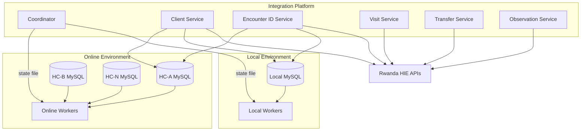

# Architecture

## Design Principles

1. **Database as message bus** — services never call each other; they read/write Medisoft database state
2. **Independent deployability** — no dependency on Medisoft application code
3. **Configuration over code** — facilities, URLs, timeouts, and credentials live in config files
4. **Continuous workers** — no cron; each service runs forever with sleep/wake polling
5. **Primary/secondary failover** — online services are primary; local services activate on outage

## Component Diagram



## Processing Modes

| Mode | Description |
|------|-------------|
| `online` | Online workers process RHIE uploads; local workers on standby |
| `local` | Online unavailable; local workers process RHIE uploads directly |
| `standby` | Neither path active; waiting for database recovery |

The coordinator writes mode decisions to `data/coordinator-state.json`. Workers read this file before each batch.

## Worker Lifecycle

```
Start → Connect DB → Loop forever:
  ├── Read coordinator state
  ├── If standby → sleep
  ├── If wrong role (local/online) → sleep
  ├── Poll DB for pending records
  ├── Process batch
  ├── Update DB status
  ├── Emit heartbeat
  └── Sleep if no work
```

## Multi-Database Workers

Online services spawn **one worker per configured facility**. Workers run concurrently via non-blocking async loops. Each worker has:

- Its own logger context (`facilityId`, `databaseId`, `workerId`)
- Its own health monitor
- Its own database connection pool

Local services spawn **one worker** for the single local database.

## Shared Packages

| Package | Responsibility |
|---------|---------------|
| `@rhie/config` | YAML/JSON loading, Zod validation, env overrides |
| `@rhie/logger` | Structured Pino logging with service context |
| `@rhie/database` | MySQL connection pools, query helpers |
| `@rhie/retry` | Exponential backoff retry manager |
| `@rhie/monitoring` | Heartbeats, health snapshots, HTTP health server |
| `@rhie/rhie-client` | Authenticated RHIE API client |
| `@rhie/shared` | Worker framework, service lifecycle, error types |

## Service Workflow Order

Services operate independently but respect this logical sequence via database status fields:

1. Client uploaded → enables encounter ID generation
2. Encounter ID assigned → enables visit upload
3. Visit completed → enables transfer upload
4. Transfer completed → enables observation upload
5. All steps complete → RHIE status fields updated

Each service only processes records whose prerequisite status fields indicate readiness.
