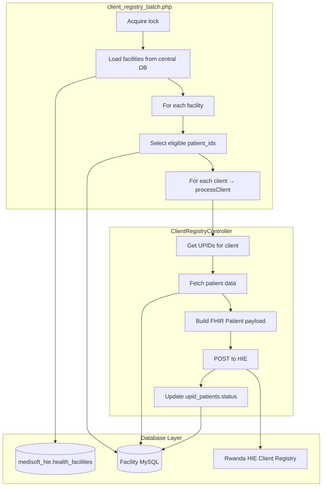

# Client Registry Analysis

Reverse-engineering analysis of the existing Medisoft PHP Client Registry implementation.

**Source files analyzed:**

| File | Role |
|------|------|
| `rhie/batches/client_registry_batch.php` | Batch entry point — multi-facility cron runner |
| `rhie/controllers/ClientRegistryController.php` | Business logic — payload build, HIE upload, status updates |
| `rhie/models/ClientRegistryModel.php` | Data access — SQL queries and status updates |
| `config/hie.php` | RHIE API credentials and base URL |
| `config/hie_link.php` | Central DB connection and per-facility DB resolution |

**Supporting files (dependencies, not in scope but referenced):**

| File | Role |
|------|------|
| `rhie/batches/batch_helpers.php` | Locking, logging, time limits, facility rotation |
| `rhie/config/batch_config.php` | Batch runtime limits and paths |
| `rhie/config/upid_filter.php` | UPID sanitization and exclusion rules |
| `rhie/api/view_upid_data.php` | HTTP API alternative to direct DB fetch (non-batch path) |

**Missing from repository (referenced but not present):**

| File | Referenced by | Impact |
|------|---------------|--------|
| `link_base_url.php` | Batch, Controller, API | Defines `BASE_URL` constant — used only in non-direct API fetch error messages |
| `link2.php` | `rhie/api/client_registry.php` | Legacy single-facility API entry point |

---

## System Overview

The Client Registry module uploads patient demographics from Medisoft facility databases to the Rwanda HIE Client Registry as FHIR `Patient` resources. Each patient is identified by a **UPID** (Unique Patient Identifier) stored in `upid_patients`.



---

## File Responsibilities

### `client_registry_batch.php`

**Purpose:** Orchestrate multi-facility batch processing of client registry uploads.

**Responsibilities:**

- Resolve `APP_ROOT` and load dependencies
- Acquire process lock (file + optional MySQL `GET_LOCK`) to prevent concurrent runs
- Initialize batch runtime (memory limit, execution time budget)
- Load HIE credentials from `config/hie.php`
- Fetch all health facilities via `getAllFacilities()` (central DB)
- Apply facility rotation slice (`rhieBatchFacilitySlice`) — processes `max_facilities_per_run` facilities per run
- For each facility: connect to facility DB, instantiate Model + Controller
- Run **client selection SQL** (currently in testing/referral mode — see Business Rules)
- Process each selected `patient_id` up to `max_clients_registry_per_run`
- On per-client exception: call `markClientAsFailed()` and continue
- Respect global time budget via `rhieBatchShouldStop()`
- Release lock and write batch status on completion

**Does NOT:** Build payloads, call HIE, or contain SQL for patient data (delegates to Model/Controller).

---

### `ClientRegistryController.php`

**Purpose:** Core business logic for a single client upload.

**Responsibilities:**

- Accept `processClient($clientID, $facility_id)`
- Load all eligible UPIDs for the client via Model
- For each UPID:
  1. Sanitize and skip excluded UPIDs (`UP*` prefix)
  2. Fetch local patient data (direct DB or HTTP API)
  3. Build FHIR Patient JSON payload
  4. POST to HIE `/clientregistry/Patient`
  5. Update `upid_patients.status` to `2` (success) or `3` (failed)
- Output JSON log of all steps to stdout (captured by batch)

**Dependencies:**

- `ClientRegistryModel` — data access
- `config/hie.php` values — URL, username, password (via constructor `$config`)
- `rhie/config/upid_filter.php` — UPID sanitization
- `config/hie_link.php` — facility DB connection (direct mode)
- `link_base_url.php` — `BASE_URL` constant (indirect mode only)

---

### `ClientRegistryModel.php`

**Purpose:** All SQL for client registry data access and status updates.

**Responsibilities:**

- `getUpidsByClient($clientID)` — UPIDs pending upload for a client
- `getClientDataByUpid($upid)` — full patient row for FHIR payload construction
- `updateUpidStatus($upid, $status)` — set status on single UPID
- `markClientAsFailed($clientID)` — mark all UPIDs for client as failed (batch error handler)

---

### `config/hie.php`

**Purpose:** Environment switch for RHIE API endpoint and credentials.

**Responsibilities:**

- `$production` boolean toggles between test and production HIE servers
- Sets `$hie_url`, `$hie_username`, `$hie_password` globals

| Environment | URL | Username |
|-------------|-----|----------|
| Test (`$production = false`) | `http://197.243.24.138:5001` | `medisoft` |
| Production (`$production = true`) | `https://devhie.moh.gov.rw:5000` | `MRS_MEDISOFT` |

---

### `config/hie_link.php`

**Purpose:** Database connectivity for multi-facility architecture.

**Responsibilities:**

- Connect to central registry DB `medisoft_hie` on `104.251.216.154`
- `getAllFacilities()` — list facilities with DB credentials
- `getFacilityPDOConnection($facility_id)` — resolve facility from central DB, open PDO to facility DB
- `resolveFacilityIdFromDbName($dbName)` — map DB name to facility ID

**Central DB tables used:**

- `health_facilities` — columns: `id`, `db_name`, `fosaid`, `db_host`, `db_user`, `db_password`

---

## Execution Order

```
1. Cron / master_batch triggers client_registry_batch.php
2. batch_helpers: acquire lock, set time/memory limits
3. hie_link: getAllFacilities() from central DB
4. batch_helpers: rhieBatchFacilitySlice() — rotate subset of facilities
5. FOR EACH facility:
   a. getFacilityPDOConnection(facilityID)
   b. new ClientRegistryModel(db)
   c. new ClientRegistryController(model, hieConfig)
   d. Run client selection SQL → array of patient_ids
   e. FOR EACH patient_id (up to max_clients_registry_per_run):
      i.   controller.processClient(patient_id, facilityID)
      ii.  On Throwable → model.markClientAsFailed(patient_id)
6. batch_helpers: rhieBatchFinish() — log duration, write status
7. Release lock, exit
```

### Inside `processClient()` per UPID

```
1. model.getUpidsByClient(clientID)
2. IF no UPIDs → return JSON error, exit
3. FOR EACH upid:
   a. rhieSanitizeUpid(upid) — skip if empty or UP* excluded
   b. getClientDataFromAPI(upid, facility_id)
      - direct mode: model.getClientDataByUpid(upid) via facility DB
      - API mode: HTTP GET view_upid_data.php
   c. IF no data → updateUpidStatus(upid, 3), continue next UPID
   d. buildPatientPayload(data)
   e. sendToHIE(payload) — POST with Basic Auth
   f. IF success → updateUpidStatus(upid, 2)
      ELSE       → updateUpidStatus(upid, 3)
4. Echo JSON summary log
```

---

## Database Usage Summary

| Database | Tables | Purpose |
|----------|--------|---------|
| Central (`medisoft_hie`) | `health_facilities` | Facility list and DB connection info |
| Facility (per health center) | `upid_patients` | UPID tracking and upload status |
| Facility | `patients` | Demographics (name, gender, DOB, phone, address IDs) |
| Facility | `referral` | Batch filter — client must have referral record |
| Facility | `districts_client` | District name and province link |
| Facility | `provinces` | Province/state name |
| Facility | `sectors_client` | Sector name |
| Facility | `cells_client` | Cell name |

See [Database Analysis](./client-registry-database-analysis.md) for full SQL documentation.

---

## API Usage Summary

| Call | When | Method | Auth |
|------|------|--------|------|
| HIE `/clientregistry/Patient` | Every UPID upload | POST | HTTP Basic Auth |
| Medisoft `view_upid_data.php` | Non-direct mode only | GET | None |

The production batch uses **direct mode** (`direct: true`) — no Medisoft HTTP API is called during batch runs.

See [RHIE API Analysis](./client-registry-rhie-api-analysis.md) for full endpoint documentation.

---

## Key Observations

### 1. Batch client selection ≠ Model UPID lookup

The batch selects clients by `upid_patients.patient_id` but the Model looks up UPIDs by `upid_patients.client_id`. These may be equivalent in the Medisoft schema, but the code uses **different column names**. This must be verified against the live schema before migration.

### 2. Testing / referral filter is active in production batch

The batch SQL requires an INNER JOIN on `referral`. The comment says "TESTING MODE — ONLY THOSE CLIENTS WHO HAVE BEEN REFERRED." This filter is **currently active** in the batch file and limits which clients are processed.

### 3. `deceasedBoolean: true` is hardcoded

Every Patient payload sets `"deceasedBoolean": true`. This appears unintentional but is production behavior and must be preserved until explicitly changed by stakeholders.

### 4. FHIR name fields are swapped

`family` is mapped from `first_name` (given_name) and `given` from `last_name` (family_name). This is the inverse of typical naming convention but matches what HIE accepts.

### 5. No OAuth / Bearer token

Authentication is HTTP Basic Auth only. No token generation, refresh, or expiration handling exists.

### 6. Status-based duplicate prevention

Records with `status = 2` (success) are excluded from all selection queries. Re-upload requires manual status reset to `0`, `1`, or `3`.
