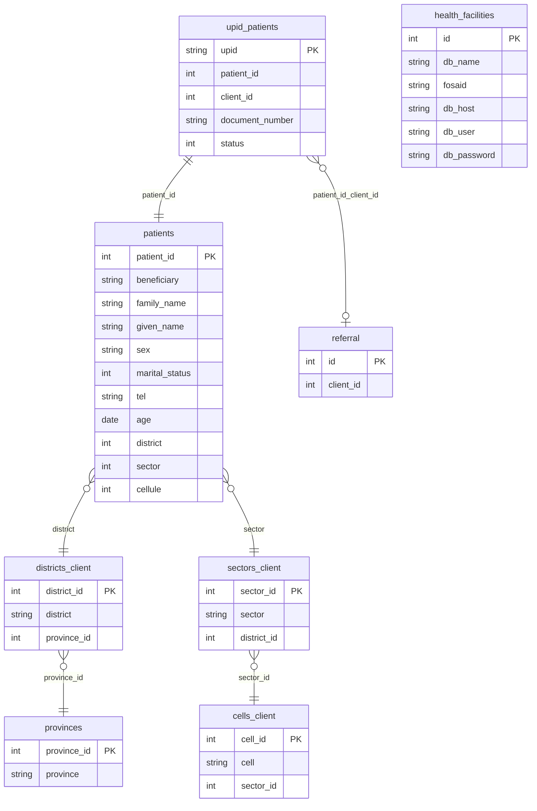

# Client Registry — Database Analysis

Complete SQL inventory for the Client Registry module.

---

## Databases

### Central database (`medisoft_hie`)

**Connection:** `config/hie_link.php` → `getCentralPDOConnection()`

| Constant | Value |
|----------|-------|
| Host | `104.251.216.154` |
| User | `remote` |
| Database | `medisoft_hie` |

### Facility databases (one per health center)

**Connection:** `getFacilityPDOConnection($facility_id)` — credentials resolved from central `health_facilities` table.

| Field | Fallback |
|-------|----------|
| `db_host` | `127.0.0.1` if empty |
| `db_user` | `root` if empty |
| `db_password` | empty string if null |
| `db_name` | required |

---

## Query 1 — List All Facilities

**File:** `config/hie_link.php` → `getAllFacilities()`

**Purpose:** Load all health facilities eligible for batch processing.

```sql
SELECT id, db_name, fosaid, db_host, db_user, db_password
FROM health_facilities
WHERE db_name IS NOT NULL
  AND db_name != ''
  AND fosaid IS NOT NULL
ORDER BY id ASC
```

| Aspect | Detail |
|--------|--------|
| Input | None |
| Output | Array of facility rows |
| Tables | `health_facilities` (central) |
| Business meaning | Defines which facility databases the batch will attempt to connect to |

---

## Query 2 — Resolve Single Facility

**File:** `config/hie_link.php` → `getFacilityPDOConnection()`

**Purpose:** Fetch connection credentials for one facility by ID.

```sql
SELECT id, db_name, fosaid, db_host, db_user, db_password
FROM health_facilities
WHERE id = ?
LIMIT 1
```

| Aspect | Detail |
|--------|--------|
| Input | `$facility_id` (integer) |
| Output | Single facility row or empty |
| Tables | `health_facilities` (central) |
| Business meaning | Dynamic per-facility DB routing |

---

## Query 3 — Batch Client Selection (Testing/Referral Mode)

**File:** `rhie/batches/client_registry_batch.php` (inline SQL)

**Purpose:** Select `patient_id` values for clients that should be uploaded in this batch run.

```sql
SELECT DISTINCT up.patient_id
FROM upid_patients up
INNER JOIN referral r
    ON up.patient_id = r.client_id
INNER JOIN patients p
    ON up.patient_id = p.patient_id
WHERE up.status IN (0, 1, 3)
  AND up.upid NOT LIKE 'UP%'
  AND up.document_number IS NOT NULL
  AND up.document_number NOT LIKE 'TP-%'
  AND p.age IS NOT NULL
  AND p.age REGEXP '^[0-9]{4}-[0-9]{2}-[0-9]{2}$'
ORDER BY up.patient_id ASC
```

| Aspect | Detail |
|--------|--------|
| Input | None (facility DB already connected) |
| Output | Array of `patient_id` integers |
| Tables | `upid_patients`, `referral`, `patients` |
| Business meaning | Find clients with valid UPIDs pending upload who have been referred and have complete demographic data |

**Column note:** `patients.age` stores the birth date in `YYYY-MM-DD` format despite the column name.

---

## Query 4 — Get UPIDs by Client

**File:** `ClientRegistryModel.php` → `getUpidsByClient()`

**Purpose:** Load all UPIDs for a given client that need processing.

```sql
SELECT DISTINCT u.upid
FROM upid_patients u
WHERE u.client_id = :clientID
  AND u.status IN (0, 1, 3)
  AND u.upid NOT LIKE 'UP%'
ORDER BY u.upid ASC
```

| Aspect | Detail |
|--------|--------|
| Input | `:clientID` (integer) — passed as `patient_id` from batch |
| Output | Array of UPID strings |
| Tables | `upid_patients` |
| Business meaning | All pending/retry/failed UPIDs for one client, excluding temporary UPIDs |

---

## Query 5 — Get Client Data by UPID

**File:** `ClientRegistryModel.php` → `getClientDataByUpid()`

**Purpose:** Fetch all fields required to build the FHIR Patient payload.

```sql
SELECT
    u.upid AS UPID,
    u.document_number AS nida,
    c.beneficiary AS full_names,
    c.family_name AS last_name,
    c.given_name AS first_name,
    c.sex AS gender,
    c.marital_status AS marital_status,
    c.tel AS phone,
    c.age AS birthdate,
    u.status AS rhie_status,
    p.province AS state,
    p.province_id AS state_id,
    d.district AS district,
    s.sector AS sector,
    ce.cell AS cell,
    CONCAT(d.district, ', ', s.sector, ', ', ce.cell) AS line,
    CASE WHEN r.id IS NOT NULL THEN TRUE ELSE FALSE END AS referral
FROM upid_patients u
INNER JOIN patients c ON u.patient_id = c.patient_id
INNER JOIN districts_client d ON c.district = d.district_id
INNER JOIN provinces p ON d.province_id = p.province_id
INNER JOIN sectors_client s ON s.sector_id = c.sector AND s.district_id = d.district_id
INNER JOIN cells_client ce ON ce.cell_id = c.cellule AND ce.sector_id = s.sector_id
LEFT JOIN referral r ON c.patient_id = r.client_id
WHERE u.upid = :upid
  AND u.status IN (0, 1, 3)
  AND u.upid NOT LIKE 'UP%'
LIMIT 1
```

| Aspect | Detail |
|--------|--------|
| Input | `:upid` (string, sanitized) |
| Output | Associative array or null |
| Tables | `upid_patients`, `patients`, `districts_client`, `provinces`, `sectors_client`, `cells_client`, `referral` |
| Business meaning | Complete patient demographic and address data for FHIR payload |

### Output field reference

| Alias | Source column | Used in payload? |
|-------|---------------|------------------|
| `UPID` | `upid_patients.upid` | Yes — `id`, identifier UPI |
| `nida` | `upid_patients.document_number` | Yes — identifier NID |
| `full_names` | `patients.beneficiary` | Parsed but **unused** in payload |
| `last_name` | `patients.family_name` | Yes — `name.given[0]` |
| `first_name` | `patients.given_name` | Yes — `name.family` |
| `gender` | `patients.sex` | Yes — mapped to male/female |
| `marital_status` | `patients.marital_status` | Yes — FHIR coding |
| `phone` | `patients.tel` | Yes — telecom with +25 prefix |
| `birthdate` | `patients.age` | Yes — `birthDate` |
| `rhie_status` | `upid_patients.status` | Read only — not written back here |
| `state` | `provinces.province` | Yes — address.state and address.city |
| `state_id` | `provinces.province_id` | Not used in payload |
| `district` | `districts_client.district` | Yes — address.district |
| `sector` | `sectors_client.sector` | Not used directly (included in line) |
| `cell` | `cells_client.cell` | Not used directly (included in line) |
| `line` | CONCAT expression | Yes — address.line |
| `referral` | computed from referral table | Not used in payload |

---

## Query 6 — Update UPID Status

**File:** `ClientRegistryModel.php` → `updateUpidStatus()`

**Purpose:** Set upload result status on a single UPID after HIE response.

```sql
UPDATE upid_patients
SET status = :status
WHERE upid = :upid
```

| Aspect | Detail |
|--------|--------|
| Input | `:status` (2=success, 3=failed), `:upid` (string) |
| Output | None (void) |
| Tables | `upid_patients` |
| Business meaning | Mark UPID as successfully uploaded or failed |

**Not updated:** `updated_at`, error message, HIE response body, upload timestamp — none stored.

---

## Query 7 — Mark All Client UPIDs Failed

**File:** `ClientRegistryModel.php` → `markClientAsFailed()`

**Purpose:** Batch error handler — mark every UPID for a client as failed.

```sql
UPDATE upid_patients
SET status = 3
WHERE client_id = :clientID
```

| Aspect | Detail |
|--------|--------|
| Input | `:clientID` (integer) |
| Output | None (void) |
| Tables | `upid_patients` |
| Business meaning | Fail-safe when unhandled exception occurs during client processing — affects **all** UPIDs regardless of current status |

**Note:** This updates UPIDs with `status = 2` (already successful) as well — no status filter on the UPDATE.

---

## Entity Relationship Diagram



---

## Status Field Summary

The Client Registry module uses **`upid_patients.status`** as the sole RHIE tracking field. There is no separate `rhie_status` column — the Model aliases `u.status AS rhie_status` in the SELECT only.

| Column | Table | Read | Write | Values |
|--------|-------|------|-------|--------|
| `status` | `upid_patients` | Selection queries | `updateUpidStatus`, `markClientAsFailed` | 0, 1, 2, 3 |
| `upid` | `upid_patients` | All queries | Never | Patient identifier |
| `document_number` | `upid_patients` | Payload (NID) | Never | National ID |
| `patient_id` | `upid_patients` | Joins | Never | Links to patients |
| `client_id` | `upid_patients` | UPID lookup, fail mark | Never | Client identifier |

**No UUIDs, Encounter IDs, or Registry response IDs are stored** by this module.

---

## Tables Not Modified

The following tables are read-only in Client Registry:

- `patients`
- `referral`
- `districts_client`
- `provinces`
- `sectors_client`
- `cells_client`
- `health_facilities`
