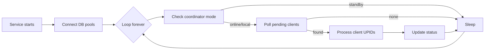

# Client Registry — Migration Strategy

Plan for converting the PHP cron batch into a long-running TypeScript service while preserving identical business logic.

---

## Current vs Target Execution Model

### Current (PHP Batch)


Characteristics:

- Process starts, runs, exits
- File lock prevents overlap
- Facility rotation via offset file
- Time budget: 540 seconds max
- Client limit: 15 per facility per run
- Logs to stdout and file

### Target (Integration Platform Service)



Characteristics:

- Process runs forever (PM2 managed)
- No file lock needed (single long-running instance per role)
- All configured facilities processed concurrently (online workers)
- No time budget exit — continuous operation
- Configurable sleep interval when idle
- Structured JSON logging

---

## What Changes vs What Stays the Same

| Aspect | PHP Batch | TypeScript Service | Change? |
|--------|-----------|-------------------|---------|
| Client selection SQL | Inline in batch | Repository method | **Logic identical** |
| UPID lookup SQL | Model | Repository | **Logic identical** |
| Patient data SQL | Model | Repository | **Logic identical** |
| FHIR payload structure | Controller | PayloadBuilder | **Byte-identical JSON** |
| HIE endpoint | POST /clientregistry/Patient | Same | **No change** |
| Auth method | HTTP Basic | HTTP Basic | **No change** |
| Success criteria | HTTP 200/201 | HTTP 200/201 | **No change** |
| Status values | 0,1,2,3 | 0,1,2,3 | **No change** |
| UPID sanitization | upid_filter.php | UpidFilter utility | **Logic identical** |
| UPID exclusion (UP*) | SQL + PHP | SQL + TypeScript | **No change** |
| Referral batch filter | Active in batch SQL | Configurable flag | **Preserve default behavior** |
| Multi-facility | Central DB rotation | Config-driven workers | **Architecture change only** |
| Direct DB access | Yes | Yes | **No change** |
| Medisoft HTTP API | Bypassed in batch | Not used | **No change** |
| Process lock | File + MySQL lock | PM2 single instance | **Mechanism change** |
| Per-run limits | 15 clients, 2 facilities | Configurable batch size | **Configurable equivalent** |
| Retry on HIE failure | Next batch run | Next poll cycle | **Same behavior, faster cycle** |
| markClientAsFailed | On exception | On exception | **Logic identical** |

---

## Migration Phases

### Phase 2a — Analysis (current)

- [x] Reverse-engineer all PHP files
- [x] Document SQL, business rules, payload mapping
- [x] Document RHIE API
- [ ] Stakeholder review of open questions (referral filter, deceasedBoolean, patient_id vs client_id)

### Phase 2b — Implementation

1. **Update `@rhie/rhie-client`** — add Basic Auth support (production uses Basic, not Bearer)
2. **Create client-service domain layer** — repository, payload builder, processor (see Service Design doc)
3. **Port SQL queries exactly** — parameterized, same JOINs, same WHERE clauses
4. **Port payload builder exactly** — including swapped names, +25 prefix, deceasedBoolean, empty extension
5. **Port UPID filter exactly** — sanitization regex and UP exclusion
6. **Wire into ContinuousWorker** — replace stub `processBatch`
7. **Add configuration** — referral filter toggle, batch size, selection mode

### Phase 2c — Parallel Run Validation

1. Run TypeScript service in **shadow mode** — build payloads, log them, but do NOT call HIE or update status
2. Compare payloads against PHP output for same UPIDs
3. Enable HIE calls on test environment
4. Compare status updates against PHP batch on test DB

### Phase 2d — Cutover

1. Disable PHP cron for `client_registry_batch.php`
2. Enable TypeScript client-service via PM2
3. Monitor health endpoints and logs
4. Keep PHP batch available for rollback for 2 weeks

---

## Mapping PHP Components to TypeScript

| PHP | TypeScript (Phase 1 platform) |
|-----|-------------------------------|
| `client_registry_batch.php` | `apps/client-service` worker loop |
| `ClientRegistryController.php` | `ClientRegistryProcessor` + `PatientPayloadBuilder` |
| `ClientRegistryModel.php` | `ClientRegistryRepository` |
| `config/hie.php` | `configs/platform.yaml` → `rhie` section |
| `config/hie_link.php` | `@rhie/database` + facility config in YAML |
| `upid_filter.php` | `packages/shared/src/upid-filter.ts` |
| `batch_helpers.php` | `@rhie/shared` worker framework + `@rhie/monitoring` |
| `batch_config.php` | `configs/platform.yaml` → `worker` section |

---

## Duplicate Upload Prevention in New Architecture

The PHP batch relies on:

1. Process lock (single batch instance)
2. Status exclusion (`status != 2`)

The TypeScript service adds:

3. Coordinator mode check (online vs local — only one role active)
4. PM2 single instance per service role
5. Optional: optimistic status transition `0/1/3 → 1 (in progress) → 2/3` before HIE call

**Recommendation:** Add an "in progress" transition only if concurrent double-upload is observed in production. The PHP code does not use this pattern — default migration preserves status values 0-3 only.

---

## Configuration Migration

### PHP (`config/hie.php`)

```php
$hie_url = "https://devhie.moh.gov.rw:5000";
$hie_username = "MRS_MEDISOFT";
$hie_password = "Qk2wM7zmrt4PcJWU";
```

### TypeScript (`configs/platform.yaml`)

```yaml
rhie:
  baseUrl: https://devhie.moh.gov.rw:5000
  auth:
    type: basic
    username: MRS_MEDISOFT
    password: ${RHIE_PASSWORD}
  clientRegistryPath: /clientregistry/Patient
  timeoutMs: 30000

worker:
  sleepIntervalMs: 5000
  batchSize: 15        # matches max_clients_registry_per_run
```

### Facility databases

PHP reads from central `health_facilities` table. TypeScript reads from `onlineDatabases` in YAML (already scaffolded in Phase 1). During migration, facility entries in YAML must match central DB records.

---

## Rollback Plan

1. Stop PM2 client-service: `pm2 stop rhie-client-service`
2. Re-enable PHP cron for `client_registry_batch.php`
3. No database schema changes required — status values are compatible

---

## Risk Register

| Risk | Mitigation |
|------|------------|
| `patient_id` vs `client_id` mismatch | Verify against live schema before implementation |
| Referral filter changes production scope | Confirm with stakeholders; make configurable with PHP default |
| `deceasedBoolean: true` rejected by HIE | Preserve exact behavior; flag for stakeholder review |
| Basic Auth not in Phase 1 RHIE client | Update `@rhie/rhie-client` before implementation |
| Double upload during parallel run | Shadow mode first; coordinator prevents online+local overlap |
