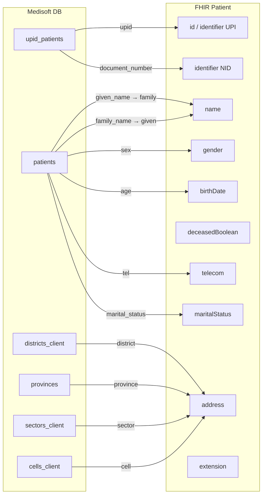

# Client Registry — Payload Mapping

Exact field mapping from Medisoft database to FHIR Patient resource as implemented in `ClientRegistryController.buildPatientPayload()`.

---

## Top-Level Fields

| FHIR Field | Source | Transformation | Example |
|------------|--------|----------------|---------|
| `resourceType` | Hardcoded | Always `"Patient"` | `"Patient"` |
| `id` | `upid_patients.upid` (alias `UPID`) | Sanitized via `rhieSanitizeUpid()` | `"602645-3179-7909"` |
| `active` | Hardcoded | Always `true` | `true` |
| `gender` | `patients.sex` (alias `gender`) | See gender mapping | `"male"` or `"female"` |
| `birthDate` | `patients.age` (alias `birthdate`) | Used as-is (YYYY-MM-DD) | `"1990-05-15"` |
| `deceasedBoolean` | Hardcoded | Always `true` | `true` |

---

## Identifier Array

| Index | FHIR Path | Source | Transformation |
|-------|-----------|--------|----------------|
| 0 | `identifier[0].system` | Hardcoded | `"UPI"` |
| 0 | `identifier[0].value` | `upid_patients.upid` | Sanitized UPID |
| 1 | `identifier[1].system` | Hardcoded | `"NID"` |
| 1 | `identifier[1].value` | `upid_patients.document_number` (alias `nida`) | As-is |

```json
"identifier": [
  { "system": "UPI", "value": "<UPID>" },
  { "system": "NID", "value": "<document_number>" }
]
```

---

## Name Array

**Important:** FHIR `family` and `given` are mapped from **swapped** Medisoft columns.

| FHIR Path | Source column | DB alias | Notes |
|-----------|---------------|----------|-------|
| `name[0].family` | `patients.given_name` | `first_name` | Typically the first/given name in Medisoft |
| `name[0].given[0]` | `patients.family_name` | `last_name` | Typically the family/surname in Medisoft |

```php
$given  = $data['last_name'];   // family_name → FHIR given
$family = $data['first_name'];  // given_name  → FHIR family
```

| FHIR Path | Value |
|-----------|-------|
| `name[0].family` | `$data['first_name']` |
| `name[0].given` | `[$data['last_name']]` |

**Unused code:** `$names = explode(' ', trim($data['full_names']))` is computed from `patients.beneficiary` but never used in the payload.

```json
"name": [
  {
    "family": "<given_name from DB>",
    "given": ["<family_name from DB>"]
  }
]
```

---

## Telecom Array

| FHIR Path | Source | Transformation |
|-----------|--------|----------------|
| `telecom[0].system` | Hardcoded | `"phone"` |
| `telecom[0].value` | `patients.tel` (alias `phone`) | `"+25" . $data['phone']` |
| `telecom[0].use` | Hardcoded | `"mobile"` |

**Note:** Prefix is `+25`, not `+250` (Rwanda country code).

```json
"telecom": [
  {
    "system": "phone",
    "value": "+25<phone>",
    "use": "mobile"
  }
]
```

---

## Address Array (single entry)

| FHIR Path | Source | Transformation |
|-----------|--------|----------------|
| `address[0].type` | Hardcoded | `"physical"` |
| `address[0].country` | Hardcoded | `"Rwanda"` |
| `address[0].state` | `provinces.province` (alias `state`) | As-is |
| `address[0].district` | `districts_client.district` (alias `district`) | As-is |
| `address[0].line` | CONCAT in SQL (alias `line`) | `"district, sector, cell"` |
| `address[0].city` | `provinces.province` (alias `state`) | Same as state |
| `address[0].postalCode` | Hardcoded | `""` (empty string) |

SQL line construction:

```sql
CONCAT(d.district, ', ', s.sector, ', ', ce.cell) AS line
```

```json
"address": [
  {
    "type": "physical",
    "country": "Rwanda",
    "state": "<province>",
    "district": "<district>",
    "line": "<district>, <sector>, <cell>",
    "city": "<province>",
    "postalCode": ""
  }
]
```

---

## Marital Status

| DB `marital_status` | FHIR `code` | FHIR `display` |
|---------------------|-------------|----------------|
| `0` or missing | `S` | Single |
| `1` | `M` | Married |
| `2` | `W` | Widowed |
| `3` | `D` | Divorced |

| FHIR Path | Value |
|-----------|-------|
| `maritalStatus.coding[0].system` | `"http://terminology.hl7.org/CodeSystem/v3-MaritalStatus"` |
| `maritalStatus.coding[0].code` | From map above |
| `maritalStatus.coding[0].display` | From map above |

```json
"maritalStatus": {
  "coding": [
    {
      "system": "http://terminology.hl7.org/CodeSystem/v3-MaritalStatus",
      "code": "M",
      "display": "Married"
    }
  ]
}
```

---

## Extension Array

| FHIR Path | Value | Notes |
|-----------|-------|-------|
| `extension[0]` | `{}` (empty object) | Required by registry but empty — "registry quirk" per code comment |

```php
"extension" => [
    new stdClass()  // serializes to {}
]
```

---

## Gender Mapping Function

```
Input (patients.sex)          →  Output
─────────────────────────────────────────
'm', 'male', '1' (any case)   →  'male'
anything else                 →  'female'
```

```php
$gender = in_array(strtolower($data['gender']), ['m', 'male', '1']) ? 'male' : 'female';
```

---

## Fields Read But Not Sent to HIE

| DB alias | Source | Reason not sent |
|----------|--------|-----------------|
| `full_names` | `patients.beneficiary` | Parsed but unused |
| `rhie_status` | `upid_patients.status` | Internal tracking only |
| `state_id` | `provinces.province_id` | Not mapped |
| `sector` | `sectors_client.sector` | Included in `line` only |
| `cell` | `cells_client.cell` | Included in `line` only |
| `referral` | computed boolean | Not part of FHIR payload |

---

## Complete Mapping Diagram



---

## Full Example

**Database row:**

| Field | Value |
|-------|-------|
| UPID | `602645-3179-7909` |
| nida | `1199887766554433` |
| first_name (given_name) | `Jean` |
| last_name (family_name) | `Mukamana` |
| gender (sex) | `F` |
| birthdate (age) | `1990-05-15` |
| phone (tel) | `0781234567` |
| marital_status | `1` |
| state (province) | `Kigali` |
| district | `Gasabo` |
| line | `Gasabo, Kimironko, Kibagabaga` |

**Resulting payload:**

```json
{
  "resourceType": "Patient",
  "id": "602645-3179-7909",
  "identifier": [
    { "system": "UPI", "value": "602645-3179-7909" },
    { "system": "NID", "value": "1199887766554433" }
  ],
  "active": true,
  "name": [{ "family": "Jean", "given": ["Mukamana"] }],
  "gender": "female",
  "birthDate": "1990-05-15",
  "deceasedBoolean": true,
  "telecom": [{ "system": "phone", "value": "+250781234567", "use": "mobile" }],
  "address": [{
    "type": "physical",
    "country": "Rwanda",
    "state": "Kigali",
    "district": "Gasabo",
    "line": "Gasabo, Kimironko, Kibagabaga",
    "city": "Kigali",
    "postalCode": ""
  }],
  "maritalStatus": {
    "coding": [{
      "system": "http://terminology.hl7.org/CodeSystem/v3-MaritalStatus",
      "code": "M",
      "display": "Married"
    }]
  },
  "extension": [{}]
}
```

Note: Example telecom shows `+250` for clarity; production code produces `+25` + phone.
