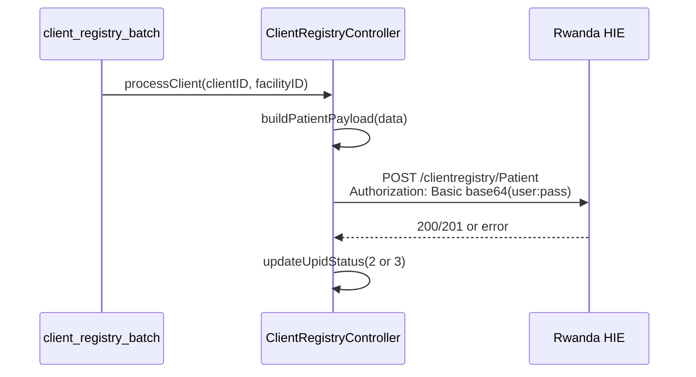

# Client Registry — RHIE API Analysis

Documentation of every external API call in the Client Registry module.

---

## Authentication Overview

The Client Registry uses **HTTP Basic Authentication** exclusively. There is no login endpoint, token generation, token refresh, or expiration handling in the codebase.



### Credential source

**File:** `config/hie.php`

| Setting | Test | Production |
|---------|------|------------|
| `$production` | `false` | `true` |
| `$hie_url` | `http://197.243.24.138:5001` | `https://devhie.moh.gov.rw:5000` |
| `$hie_username` | `medisoft` | `MRS_MEDISOFT` |
| `$hie_password` | `medisoft@hie2024` | `Qk2wM7zmrt4PcJWU` |

Credentials are passed to the Controller via:

```php
$config = [
    'url' => $hie_url,
    'username' => $hie_username,
    'password' => $hie_password,
    'direct' => true,
];
```

### Authorization header construction

**File:** `ClientRegistryController.php` → `sendToHIE()`

```php
CURLOPT_USERPWD => $this->hie_username . ':' . $this->hie_password
```

cURL automatically encodes this as `Authorization: Basic <base64(username:password)>`.

### Token lifecycle

| Concern | Implementation |
|---------|----------------|
| Login | Not implemented — Basic Auth on every request |
| Token generation | Not applicable |
| Token refresh | Not applicable |
| Expiration handling | Not applicable |
| Session storage | Not applicable |

---

## Endpoint 1 — Upload Patient to Client Registry

### Request

| Property | Value |
|----------|-------|
| **URL** | `{hie_url}/clientregistry/Patient` |
| **Method** | `POST` |
| **Production URL** | `https://devhie.moh.gov.rw:5000/clientregistry/Patient` |
| **Test URL** | `http://197.243.24.138:5001/clientregistry/Patient` |

### Headers

| Header | Value |
|--------|-------|
| `Content-Type` | `application/fhir+json` |
| `Accept` | `application/fhir+json` |
| `Authorization` | `Basic {base64(username:password)}` |

### Request body

FHIR R4 `Patient` resource as JSON. See [Payload Mapping](./client-registry-payload-mapping.md).

```json
{
  "resourceType": "Patient",
  "id": "602645-3179-7909",
  "identifier": [
    { "system": "UPI", "value": "602645-3179-7909" },
    { "system": "NID", "value": "1199887766554433" }
  ],
  "active": true,
  "name": [{ "family": "Jean", "given": ["Mukamana"] }],
  "gender": "female",
  "birthDate": "1990-05-15",
  "deceasedBoolean": true,
  "telecom": [{ "system": "phone", "value": "+25781234567", "use": "mobile" }],
  "address": [{
    "type": "physical",
    "country": "Rwanda",
    "state": "Kigali",
    "district": "Gasabo",
    "line": "Gasabo, Kimironko, Kibagabaga",
    "city": "Kigali",
    "postalCode": ""
  }],
  "maritalStatus": {
    "coding": [{
      "system": "http://terminology.hl7.org/CodeSystem/v3-MaritalStatus",
      "code": "M",
      "display": "Married"
    }]
  },
  "extension": [{}]
}
```

JSON encoded with `JSON_UNESCAPED_SLASHES`.

### Response handling

| HTTP Status | Treated as | Action |
|-------------|------------|--------|
| `200` | Success | `updateUpidStatus(upid, 2)` |
| `201` | Success | `updateUpidStatus(upid, 2)` |
| Any other | Failure | `updateUpidStatus(upid, 3)` |
| cURL error (no response) | Failure | `updateUpidStatus(upid, 3)` |

```php
return [
    'success' => in_array($status, [200, 201]),
    'status' => $status,
    'response' => json_decode($response, true) ?? $response
];
```

### Success response

- Response body is JSON-decoded if possible, otherwise returned as raw string
- **Response body is not persisted** to the database
- **No UPID or registry ID extracted** from response

### Failure response

| Failure type | `success` | `status` | `response` |
|--------------|-----------|----------|------------|
| Network/cURL error | `false` | `null` | cURL error string |
| HTTP 4xx/5xx | `false` | HTTP code | Parsed JSON or raw body |

---

## Endpoint 2 — Fetch Local Patient Data (Non-Direct Mode Only)

This endpoint is **not used by the production batch** (`direct: true`). Documented for completeness.

### Request

| Property | Value |
|----------|-------|
| **URL** | `https://medisoft.rw/rhie/api/view_upid_data.php?upid={upid}&facility_id={facility_id}` |
| **Method** | `GET` |

### Headers

| Header | Value |
|--------|-------|
| `Accept` | `application/json` |

No authentication.

### Response (success)

```json
{
  "success": true,
  "facility_id": 123,
  "message": "Data retrieved successfully.",
  "data": { /* same fields as getClientDataByUpid */ }
}
```

### Response (failure)

Returns `null` to Controller when:

- cURL fails
- JSON decode fails
- `success` is empty/false
- `data` is empty

Controller action: `updateUpidStatus(upid, 3)`.

---

## Endpoint 3 — Manual API Trigger (Legacy)

**File:** `rhie/api/client_registry.php`

| Property | Value |
|----------|-------|
| **URL** | Medisoft-hosted POST endpoint |
| **Method** | `POST` |
| **Body** | `{ "client_id": 123 }` |

Uses hardcoded test HIE credentials (not `config/hie.php`). Calls `processClient($clientID)` **without `facility_id`** — incompatible with direct mode. Legacy/debug entry point only.

---

## Error Handling Matrix

| Layer | Error | Retry? | Status update |
|-------|-------|--------|---------------|
| HIE POST | cURL failure | No — next batch run | 3 |
| HIE POST | HTTP 4xx | No — next batch run | 3 |
| HIE POST | HTTP 5xx | No — next batch run | 3 |
| Local fetch | No data | No | 3 |
| Local fetch | DB connection fail | No | 3 (via no data path) |
| Batch | Unhandled exception | No | All client UPIDs → 3 |

---

## Phase 1 Platform Gap

The Phase 1 `@rhie/rhie-client` package was scaffolded with Bearer/OAuth2 auth. The **actual production Client Registry uses HTTP Basic Auth**. The RHIE client must be updated to support Basic Auth before implementation.

Recommended config mapping:

```yaml
rhie:
  baseUrl: https://devhie.moh.gov.rw:5000
  auth:
    type: basic
    username: MRS_MEDISOFT
    password: ${RHIE_PASSWORD}
  clientRegistryPath: /clientregistry/Patient
```
