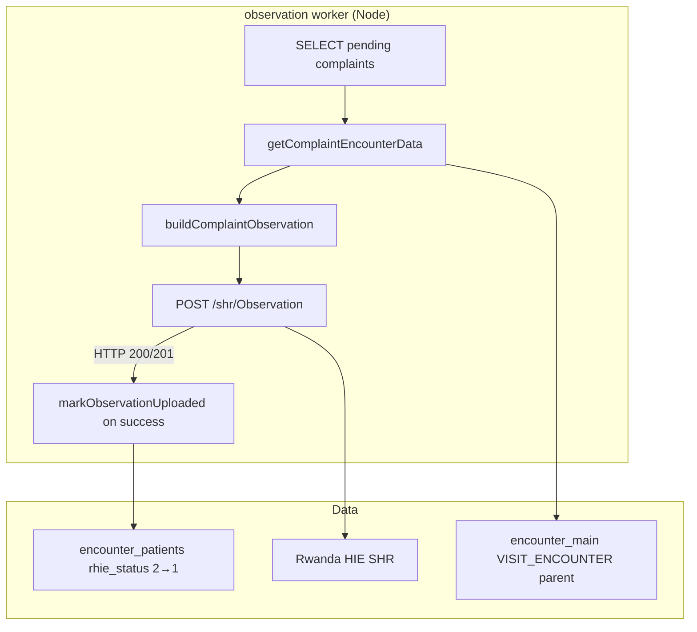

# Complaint Encounter Upload Analysis

Reverse-engineering analysis of the PHP Complaint Encounter Upload implementation.

**Source files analyzed:**

| File | Role |
|------|------|
| `rhie/models/GetEncounterModel.php` | SQL for complaint payload fields (`getComplaintEncounterData`) |
| `rhie/models/UploadEncounterModel.php` | Data fetch wrapper + `markObservationUploaded` |
| `rhie/controllers/traches/UploadEncounterController.php` | `buildComplaintObservation()`, upload loop, HTTP send |
| `rhie/api/get_complaint_encounter_api.php` | HTTP API for complaint data (non-batch path) |
| `rhie/controllers/GetEncounterController.php` | Thin wrapper over GetEncounterModel |
| `rhie/config/upid_filter.php` | UPID sanitization and exclusion |

**Related dependencies (upstream — must exist before upload):**

| Dependency | Requirement |
|------------|-------------|
| Encounter ID generation | `encounter_patients` row with `type = 'complaint'`, `rhie_status = 2` |
| Visit encounter upload | Parent `encounter_main` VISIT_ENCOUNTER with valid UPID |
| Client registry | `upid_patients.status = 2` |
| Source data | `vital_sign` (vital_id=9) + `plaintes` via `ep.source_id` |

**Note:** The committed `rhie/controllers/UploadEncounterController.php` (non-traches) does **not** include complaint upload — only referral. The traches controller contains the full observation upload implementation including complaints.

---

## System Overview

Complaint Encounter Upload posts FHIR **Observation** resources to the SHR for chief-complaint records stored in `encounter_patients` (`type = 'complaint'`).



---

## Workflow

1. Select pending `encounter_patients` rows where `type = 'complaint'` and `rhie_status = 2`
2. For each distinct `(client_id, date)`:
   - Fetch complaint rows via `getComplaintEncounterData`
   - Sanitize UPID, skip `UP%` prefixes
   - Match `display === 'Chief Complaint'` (from SQL)
   - Build FHIR Observation payload
   - POST to `/shr/Observation`
   - **On HTTP 200/201 only:** `markObservationUploaded(observation_encount_id)`

---

## SQL Queries

### Payload fetch (`GetEncounterModel::getComplaintEncounterData`)

See `services/observation/src/repository/sql.ts` — exact match.

### Mark uploaded (`UploadEncounterModel::markObservationUploaded`)

```sql
UPDATE encounter_patients
SET rhie_status = 1, rhie_uploaded_at = NOW()
WHERE encount_id = ?
```

### Batch selection (Node-derived)

No dedicated PHP complaint batch exists. Node batch SQL combines:
- `getComplaintEncounterData` filters (`type = complaint`, `rhie_status = 2`)
- Visit batch patient eligibility (`upid_patients.status = 2`, age regex, document rules)

---

## RHIE API

| Property | Value |
|----------|-------|
| Method | POST |
| URL | `{hie_url}/shr/Observation` |
| Content-Type | `application/fhir+json` |
| Auth | HTTP Basic |
| Success | 200, 201 |
| Retry | None |

---

## Key Difference from Visit Encounter Upload

| Aspect | Visit Encounter | Complaint Encounter |
|--------|-----------------|---------------------|
| Resource | FHIR Encounter | FHIR Observation |
| Table updated | `encounter_main` | `encounter_patients` |
| Mark on failure | Yes (unconditional) | **No** (success only) |
| Endpoint | `/shr/Encounter` | `/shr/Observation` |

---

## Known PHP Quirk

The traches upload loop checks `$o['display'] === 'Chief Complaintt'` (typo with double-t), but `GetEncounterModel` returns `'Chief Complaint'`. **Complaints would never upload via that branch.** Node matches the SQL output `'Chief Complaint'` for intended behavior; documented in parity report.
