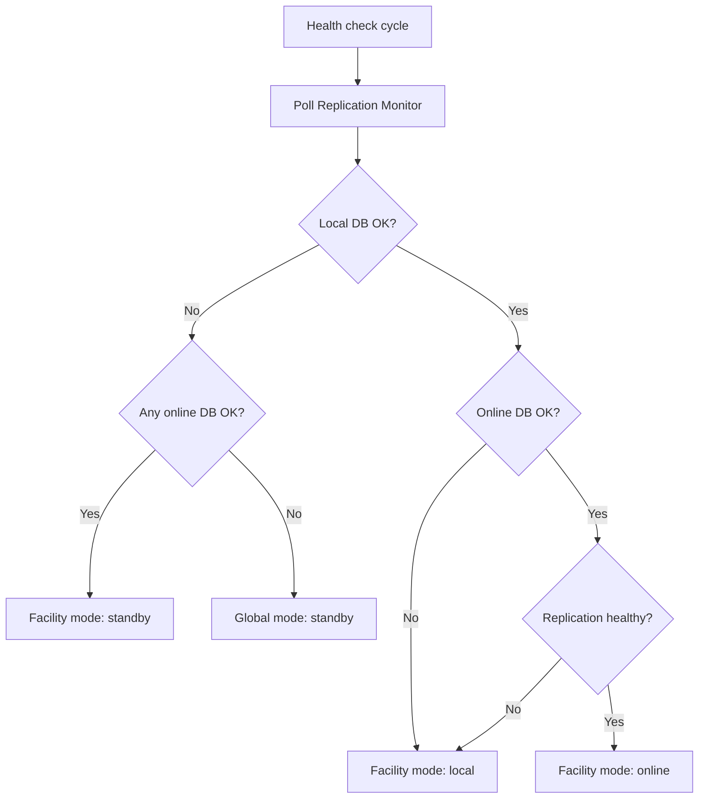

# Coordinator

The `@rhie/coordinator` app is the orchestration brain of the platform. It does **not** upload data.

## Responsibilities

1. Monitor local and online database connectivity
2. Poll worker-host health endpoints
3. Compute processing mode per facility (`online`, `local`, `standby`)
4. Write state to `data/coordinator-state.json`
5. Detect failed/stale workers
6. Attempt database reconnection on failure

## Processing Mode Logic

The coordinator uses **database connectivity pings** plus **replication health from the Replication Monitor** (`/replication/status`). The coordinator does not query MySQL replication directly.



| Condition | Mode |
|-----------|------|
| Local OK + Online OK + Replication healthy | `online` |
| Local OK + (Online down OR replication unhealthy) | `local` |
| Online OK + Local down | `standby` |
| Both down | `standby` |

See [Replication Monitor](replication-monitor.md) for monitor configuration.

## Worker Host Monitoring

Coordinator polls configured `workerHostEndpoints` every cycle:

```yaml
coordinator:
  workerHostEndpoints:
    - name: client-registry-host
      healthUrl: http://127.0.0.1:9091/health
      metricsUrl: http://127.0.0.1:9191/metrics
```

Detects:
- Unreachable hosts → `offline`
- Workers with `status: error` → `degraded`
- Stale heartbeats (> `serviceHeartbeatTimeoutMs`) → `degraded`

## State File

Written to `./data/coordinator-state.json`:

```json
{
  "updatedAt": "2026-06-28T12:00:00.000Z",
  "globalMode": "online",
  "facilities": {
    "HC-A": { "facilityId": "HC-A", "mode": "online", "onlineAvailable": true }
  },
  "workerHosts": {
    "client-registry-host": { "name": "client-registry-host", "status": "healthy", "workerCount": 4 }
  }
}
```

Workers read this file (2-second cache) to determine if they should process.

## Health Endpoint

Coordinator exposes `GET /health` on port 9090 (configurable).

## Configuration

| Key | Default | Description |
|-----|---------|-------------|
| `syncHealthCheckIntervalMs` | 15000 | Evaluation cycle interval |
| `serviceHeartbeatTimeoutMs` | 45000 | Stale worker threshold |
| `stateFilePath` | `./data/coordinator-state.json` | Mode state output |
| `workerHostEndpoints` | [] | Worker hosts to monitor |
| `autoRestartFailedWorkers` | true | Future: signal restarts |

## Duplicate Upload Prevention

- Only one mode active at a time per facility
- Workers check coordinator state before each batch
- PM2 single instance per worker-host role
