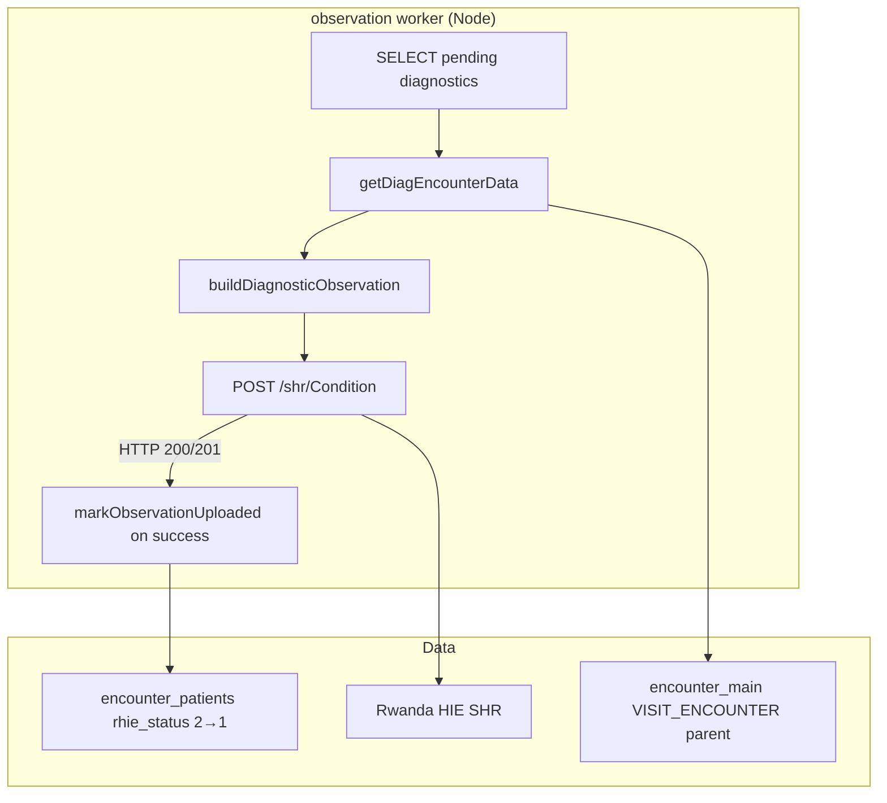

# Diagnosis Encounter Upload — Analysis

Reverse-engineering analysis of the PHP Diagnosis Encounter Upload implementation.

**Source files analyzed:**

| File | Role |
|------|------|
| `rhie/models/GetEncounterModel.php` | SQL for diagnosis payload fields (`getDiagEncounterData`) |
| `rhie/models/UploadEncounterModel.php` | Data fetch wrapper + `markObservationUploaded` |
| `rhie/controllers/traches/UploadEncounterController.php` | `buildDiagnosticObservation()`, upload loop, HTTP send |
| `rhie/api/get_diag_encounter_api.php` | HTTP API for diagnosis data (non-batch path) |
| `rhie/config/upid_filter.php` | UPID sanitization and exclusion |

---

## System Overview

Diagnosis Encounter Upload posts FHIR **Condition** resources to the SHR for diagnostic records stored in `encounter_patients` (`type = 'diagnostic'`).

---

## Key PHP Parity Notes

| Aspect | PHP behavior |
|--------|--------------|
| Payload fetch SQL | **No** `ep.rhie_status = 2` filter (unlike complaint) |
| Display from SQL | `'Diagnostic'` |
| Upload branch condition | `$o['display'] === 'Diagnosticc'` — **dead code typo** |
| FHIR resource | `Condition` (not Observation) |
| Endpoint | `POST /shr/Condition` |
| ICD code in payload | Hardcoded `'1F42'` (not from DB) |
| Mark on success only | Yes — `markObservationUploaded` only when HTTP 200/201 |

---

## Node Implementation

| Component | Path |
|-----------|------|
| Processor | `services/observation/src/domain/diagnosis-encounter.processor.ts` |
| Payload builder | `services/observation/src/domain/diagnosis-payload.builder.ts` |
| Repository | `services/observation/src/repository/diagnosis-encounter.repository.ts` |
| SQL | `services/observation/src/repository/sql.ts` |
| Worker | `services/observation/src/worker/observation.worker.ts` (runs after complaint batch) |

---

## Dependencies

| Dependency | Requirement |
|------------|-------------|
| Client registry | `upid_patients.status = 2` |
| Encounter ID generation | `encounter_patients` row with `type = 'diagnostic'` |
| Visit encounter ID | Parent `encounter_main` VISIT_ENCOUNTER exists |
| Source data | `diag_client` + `diags.english` via `ep.source_id` |
