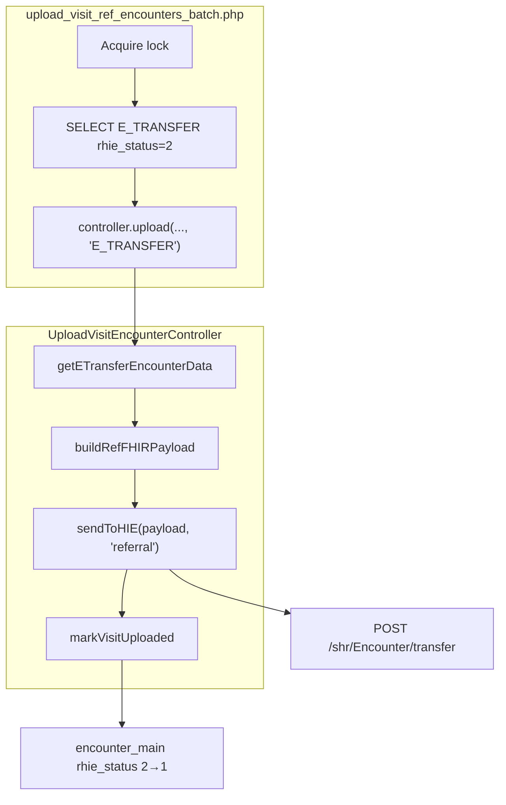

# E_TRANSFER (Visit Referral Encounter) Upload — Analysis & Comparison

Analysis of PHP `upload_visit_ref_encounters_batch.php` compared with `upload_visit_encounters_batch.php` and the migrated `@rhie/service-visit-encounter` service.

**Scope:** E_TRANSFER upload via `UploadVisitEncounterController` only.  
**Out of scope:** `upload_encounters_batch.php` (observation upload after `rhie_status = 1`), `TRANSFER_ENCOUNTER` referral observation path.

---

## 1. PHP Workflow Analysis

### Architecture (shared with VISIT_ENCOUNTER)

Both batches use the **identical MVC stack**:

| Layer | Component |
|-------|-----------|
| Batch | `upload_visit_*_encounters_batch.php` |
| Controller | `UploadVisitEncounterController` |
| Model | `UploadEncounterModel` → `GetEncounterModel` (direct reads in batch) |
| Credentials | `config/hie.php` (`$hie_url`, `$hie_username`, `$hie_password`) |



### Batch steps (`upload_visit_ref_encounters_batch.php`)

1. Acquire lock — **same lock name** as visit batch: `upload_visit_encounters_batch` (copy-paste; mutual exclusion with visit upload cron)
2. Load facilities, connect per facility
3. Selection SQL: `encounter_main.type = 'E_TRANSFER'`, `rhie_status = 2`, same UPID/patient eligibility as visit batch
4. For each row: `$controller->upload($client_id, $date, 'E_TRANSFER', $facilityID)`
5. Per-row try/catch; facility-level try/catch
6. Echo JSON with `"we are in" => "transfer batch"`

### Controller path for `E_TRANSFER`

```php
$visits = $this->model->getETransferEncounterData($clientId, $date, $facilityId);
// ...
$payload = $this->buildRefFHIRPayload($visit);
$results[] = $this->sendToHIE($payload, 'referral');
$this->model->markVisitUploaded($visit['resource_encount_id']);
```

### Prerequisite chain

`getETransferEncounterData` requires parent visit already uploaded:

```sql
INNER JOIN encounter_main ve
  ON ve.client_id = et.client_id AND ve.date = et.date
  AND ve.type = 'VISIT_ENCOUNTER' AND ve.rhie_status = 1
```

E_TRANSFER rows with `rhie_status = 2` are selected by the batch, but payload fetch **fails silently** (returns empty) if parent visit is not yet `rhie_status = 1`.

### Not the same as `upload_encounters_batch.php`

| | `upload_visit_ref_encounters_batch` | `upload_encounters_batch` |
|--|-------------------------------------|---------------------------|
| Purpose | Upload E_TRANSFER Encounter to HIE | Upload observations for uploaded E_TRANSFER |
| `rhie_status` filter | **2** (pending upload) | **1** (already uploaded) |
| Controller | `UploadVisitEncounterController` | `UploadEncounterController` |
| Requires referral JOIN | No | Yes |

---

## 2. Difference Report: VISIT_ENCOUNTER vs E_TRANSFER

| # | Aspect | VISIT_ENCOUNTER | E_TRANSFER |
|---|--------|-----------------|------------|
| 1 | **Batch selection SQL** | `type IN ('VISIT_ENCOUNTER')` | `type IN ('E_TRANSFER')` |
| 2 | **Selection criteria** | Same: `em.rhie_status=2`, `up.status=2`, UPID/age/document rules | Same |
| 3 | **Payload fetch method** | `getVisitEncounterData` | `getETransferEncounterData` |
| 4 | **Payload fetch SQL** | Single `encounter_main` row + clientts/patients/address | Joins E_TRANSFER row + **parent VISIT_ENCOUNTER (`rhie_status=1`)** + clientts |
| 5 | **Business rules** | UPID sanitize/exclude; no parent dependency | Same UPID rules + **parent visit must be uploaded** |
| 6 | **Payload builder** | `buildFHIRPayload()` | `buildRefFHIRPayload()` |
| 7 | **FHIR resource** | Encounter | Encounter |
| 8 | **Encounter status** | `finished` | `planned` |
| 9 | **Type display** | `VISIT_ENCOUNTER` | `TRANSFER_ENCOUNTER` (from SQL `type_display`) |
| 10 | **Period** | `start` only | `start` + `end` (`date('c')` at upload time) |
| 11 | **Location** | Single facility (`location_id` / `facility_name`) | Origin HC + **hospitalization** origin/destination |
| 12 | **partOf** | None | `Encounter/{reference_encount_id}` (parent visit UUID) |
| 13 | **Endpoint** | `POST /shr/Encounter` | `POST /shr/Encounter/transfer` |
| 14 | **sendToHIE kind** | `'visit'` | `'referral'` |
| 15 | **Authentication** | HTTP Basic | Same |
| 16 | **Headers** | `application/fhir+json` | Same |
| 17 | **Response handling** | Returns metadata array; no success gate | Same |
| 18 | **Status update** | `markVisitUploaded` on `encounter_main` | **Same** — unconditional after send |
| 19 | **Retry** | None | None |
| 20 | **Logging** | echo stdout | Same pattern + referral payload echo when `kind=referral` |

### SQL side-by-side (batch selection)

Only difference is the `type` literal:

```sql
-- VISIT
WHERE type IN ('VISIT_ENCOUNTER') AND em.rhie_status = 2 ...

-- E_TRANSFER (upload_visit_ref_encounters_batch.php)
WHERE type IN ('E_TRANSFER') AND em.rhie_status = 2 ...
```

### Payload fetch SQL (E_TRANSFER-specific)

See `GetEncounterModel::getETransferEncounterData` — selects from `encounter_main et` (E_TRANSFER) with inner join to uploaded parent visit `ve`.

### Known PHP data gap

`buildRefFHIRPayload` references `$visit['destination_location_id']`, but `getETransferEncounterData` SQL does **not** select that column (only `origin_location_id`, `destination_facility_name`). PHP emits `Location/` with an empty/null suffix. Node must preserve this behavior for parity.

### Dead code in committed controller

`TRANSFER_ENCOUNTER` branch calls `buildTransferFHIRPayload()` / `sendTransferToHIE()` — methods **not defined** in committed `UploadVisitEncounterController.php`. Only `E_TRANSFER` → `buildRefFHIRPayload` is live for the ref batch.

---

## 3. Parent VISIT_ENCOUNTER requirement (verified)

**Not every E_TRANSFER row selected by the batch has an uploaded parent visit at selection time.**

| Stage | Parent visit enforced? | PHP behavior |
|-------|------------------------|--------------|
| Batch selection (`upload_visit_ref_encounters_batch.php`) | **No** | Only filters `type = 'E_TRANSFER'`, `rhie_status = 2`, UPID/patient rules |
| Payload fetch (`getETransferEncounterData`) | **Yes** | `INNER JOIN encounter_main ve … ve.type = 'VISIT_ENCOUNTER' AND ve.rhie_status = 1` |

When parent visit is **missing** or **`rhie_status ≠ 1`**:

1. Batch still selects the E_TRANSFER row.
2. `getETransferEncounterData` returns **[]** (INNER JOIN excludes it).
3. Controller `foreach` never runs — **no upload, no exception**.
4. **`markVisitUploaded` is NOT called** — E_TRANSFER remains `rhie_status = 2`.
5. Batch echoes `"status": "success"` with `"response": []` anyway.

This is silent deferral until the parent visit is uploaded. Node reproduces this exactly: empty fetch → `return []` → no mark → batch counts as `skipped`.

Worker order: VISIT_ENCOUNTER pass runs before E_TRANSFER pass so parent visits can reach `rhie_status = 1` in the same cycle.

**Note:** `RealtimeTransferService` adds explicit guards before upload (different code path, stricter than the batch).

---

## 4. Comparison with Node.js `@rhie/service-visit-encounter`

| Aspect | Node today | E_TRANSFER needs |
|--------|------------|------------------|
| Worker | `VisitEncounterWorker` | Same worker |
| Processor | `VisitEncounterProcessor` | Extend `upload()` + add batch pass |
| Repository | `getVisitEncounterData`, `findPendingVisitEncounters` | Add E_TRANSFER SQL + methods |
| Payload builder | `VisitPayloadBuilder.build()` | Add `buildRef()` (or `ETransferPayloadBuilder`) |
| RHIE client | `uploadVisitEncounterOnce(..., 'referral')` | **Already supports** `/transfer` path |
| Config | `visitEncounter.executionMode` | Same shadow/production |
| Type union | `'E_TRANSFER'` in signature but **throws unsupported** | Enable branch |

The existing `uploadVisitEncounterOnce` already routes `kind === 'referral'` to `${visitEncounterPath}/transfer` — no RHIE client changes required.

---

## 5. Recommendation

### Extend the existing `visit-encounter` service — do NOT create a separate E_TRANSFER service

**Rationale:**

1. **PHP uses one controller** (`UploadVisitEncounterController`) for both VISIT_ENCOUNTER and E_TRANSFER.
2. **Same workflow:** select → fetch → sanitize UPID → build FHIR Encounter → POST → `markVisitUploaded`.
3. **Same DB update:** `encounter_main.rhie_status = 1`, unconditional after send.
4. **Same infrastructure:** credentials, headers, retry (none), error handling pattern.
5. **Differences are parameterized:** batch SQL type filter, payload fetch SQL, builder method, endpoint suffix `/transfer`.

**Why not `@rhie/service-transfer-encounter`?**

- Platform stub `transfer-encounter` host (PM2 port 9094) appears reserved for a **different** workflow (`upload_encounters_batch` / referral observations / `TRANSFER_ENCOUNTER` type), not `upload_visit_ref_encounters_batch`.
- Creating a second service would duplicate controller logic PHP intentionally keeps unified.
- User constraint: do not modify Registry/PM2 — extending `visit-encounter` avoids registering new workers.

**Worker batch ordering (recommended):**

Within `VisitEncounterWorker.processBatch()`, run in order:

1. `processPendingVisitEncounters(batchSize)` — VISIT_ENCOUNTER
2. `processPendingETransferEncounters(batchSize)` — E_TRANSFER

This mirrors the PHP prerequisite (parent visit `rhie_status = 1` before E_TRANSFER payload fetch succeeds).

---

## 6. Planned Implementation (minimal extension)

When approved to implement:

| File | Change |
|------|--------|
| `repository/sql.ts` | Add `SQL_FIND_PENDING_E_TRANSFER`, `SQL_GET_E_TRANSFER_DATA` |
| `repository/visit-encounter.repository.ts` | Add find/get methods |
| `domain/visit-payload.builder.ts` | Add `buildRef()` porting `buildRefFHIRPayload` |
| `domain/types.ts` | Add `ETransferEncounterDataRow` |
| `domain/visit-encounter.processor.ts` | Enable `E_TRANSFER` in `upload()`; add `processPendingETransferEncounters()` |
| `worker/visit-encounter.worker.ts` | Run visit pass then E_TRANSFER pass; merge `BatchResult` |
| Tests | SQL parity, payload builder, processor shadow/E_TRANSFER branch |

**Do not touch:** `@rhie/rhie-client` (referral path exists), Coordinator, Worker Host, Registry, PM2, `transfer-encounter` stub.

**Leave `transfer-encounter` stub** until `upload_encounters_batch` / observation migration is scoped.

---

## 7. PHP-to-Node Parity Checklist (pre-implementation)

| Check | Expected parity |
|-------|-----------------|
| Batch SQL | `type IN ('E_TRANSFER')`, identical eligibility |
| Fetch SQL | Exact `getETransferEncounterData` |
| Parent visit join | `ve.rhie_status = 1` |
| Payload | `buildRefFHIRPayload` all fields |
| Endpoint | `POST /shr/Encounter/transfer` |
| Mark uploaded | Unconditional `markVisitUploaded` |
| Missing `destination_location_id` | Preserve undefined/empty in payload |
| Shadow mode | Build + log; skip POST + DB update |

---

## 8. Verdict

E_TRANSFER upload is an **extension of Visit Encounter Upload**, not a separate service. Implement as additional methods and SQL in `@rhie/service-visit-encounter` with a second batch pass in the existing worker.

Implementation should proceed **before** further complaint/observation work, and **after** this analysis is accepted.
