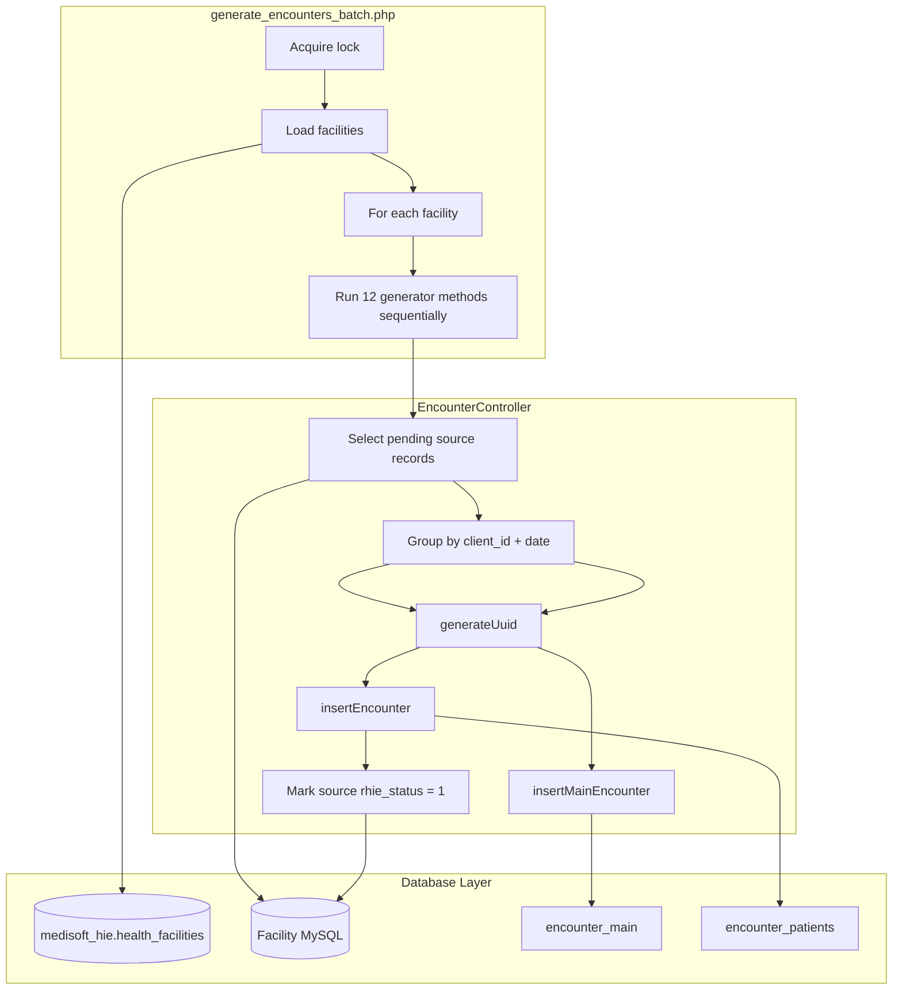

# Encounter ID Analysis

Reverse-engineering analysis of the existing Medisoft PHP Encounter ID (encounter generation) implementation.

**Source files analyzed:**

| File | Role |
|------|------|
| `rhie/batches/generate_encounters_batch.php` | Batch entry point — multi-facility encounter ID generation |
| `rhie/controllers/EncounterController.php` | Business logic — selection, grouping, UUID generation, inserts, status updates |
| `rhie/models/EncounterModel.php` | Data access — SQL inserts and source-table status updates |
| `config/hie_link.php` | Central DB connection and per-facility DB resolution |
| `rhie/config/upid_filter.php` | UPID sanitization and exclusion (`UP%` prefix) |

**Supporting files (dependencies, referenced):**

| File | Role |
|------|------|
| `rhie/batches/batch_helpers.php` | Locking, logging, time limits, facility rotation |
| `rhie/config/batch_config.php` | Batch runtime limits and paths |
| `rhie/batches/master_batch.php` | Orchestrates all RHIE batches including encounter generation |

**Related but out of scope (downstream upload services):**

| File | Role |
|------|------|
| `rhie/batches/upload_encounters_batch.php` | Uploads visit encounters to HIE (Visit Encounter service) |
| `rhie/batches/upload_visit_encounters_batch.php` | Visit encounter FHIR upload |
| `rhie/controllers/UploadVisitEncounterController.php` | FHIR Encounter payload build + HIE POST |
| `rhie/controllers/UploadEncounterController.php` | Observation upload orchestration |

---

## System Overview

The Encounter ID module **generates local UUID encounter identifiers** and persists them in Medisoft facility databases. It does **not** call the Rwanda HIE API. Generated IDs live in `encounter_main` (parent encounters) and `encounter_patients` (child/observation encounters) and are consumed later by upload batches.

---

## File Responsibilities

### `generate_encounters_batch.php`

**Purpose:** Orchestrate multi-facility encounter ID generation across all encounter types.

**Responsibilities:**

- Acquire process lock via `rhieBatchAcquireLock('generate_encounters_batch')`
- Load facilities via `getAllFacilities()` with optional rotation slice
- Connect to each facility DB via `getFacilityPDOConnection($facilityID)`
- Instantiate `EncounterController` per facility
- Run **12 generator methods** in fixed order (errors per method are caught; facility loop continues)
- Hardcoded start dates in committed code:
  - Most generators: `$generate_from = "2026-06-24" ?? date('Y-m-d')` → always `"2026-06-24"`
  - E-transfer: `$start_from = '2026-06-20'`
- Release lock on completion

**Does NOT:** Call HIE, build FHIR payloads, or upload encounters.

**Generator execution order:**

1. `generateEncountersVisit`
2. `generateEncountersTransfer`
3. `generateEncountersFromOrders` (consultation → `CONSULTATION_ENCOUNTER`)
4. `generateComplaintEncounters`
5. `generateVitalSignEncounters`
6. `generateLabRequestEncounters`
7. `generateEncountersFromOrders` (med → `MEDICINE_ENCOUNTER`)
8. `generateLabEncounters`
9. `generateDiagEncounters`
10. `generateVitalNCDsEncounters`
11. `generatePlaintesNCDsEncounters`
12. `generateDiagnosticNCDsEncounters`
13. `generateReferralEncounters`

**Note:** Controller methods do not return `{ message: ... }` arrays, yet the batch echoes `$visitResult['message']`. This is a PHP runtime issue in the committed code; TypeScript should return structured results for logging.

---

### `EncounterController.php`

**Purpose:** Core business logic for encounter ID generation per encounter type.

**Responsibilities:**

- Execute type-specific selection SQL with date range filter (`BETWEEN ? AND CURRENT_DATE()`)
- Exclude UPIDs matching `UP%` via SQL (`u.upid NOT LIKE 'UP%'`)
- Sanitize UPID via `rhieSanitizeUpid()` before insert
- Group rows by `client_id + '_' + date` (or `patient_id + '_' + date` for vital-based queries)
- Generate UUID v4-like IDs via `generateUuid()` (mt_rand-based, PHP-specific)
- Insert into `encounter_main` and/or `encounter_patients` with `rhie_status = 2`
- Update source table `rhie_status` to `1` after successful insert
- Deduplicate main encounters via `checkMainEncounterExists()` where applicable

**Additional public methods (used by upload controllers, not batch):**

- `ensureVisitEncounterForClient($clientId, $date)` — on-demand visit encounter creation
- `ensureReferralEncounterForClient($clientId, $date, $referralId?)` — on-demand referral encounter

**Does NOT:** Call external APIs, handle upload status on `encounter_main`/`encounter_patients` (that is upload batch responsibility).

---

### `EncounterModel.php`

**Purpose:** Data access for encounter inserts and source status updates.

**Methods:**

| Method | Target |
|--------|--------|
| `insertMainEncounter` | `encounter_main` with ON DUPLICATE KEY UPDATE |
| `insertEncounter` | `encounter_patients` plain INSERT |
| `checkMainEncounterExists` | Existence check on `encounter_main` |
| `markVisitAsUploaded` | `clientts.rhie_status = 1` |
| `markOrderAsUploaded` | `orders.rhie_status = 1` |
| `markLabAsUploaded` | `lab_results.rhie_status = 1` |
| `markDiagAsUploaded` | `diag_client.rhie_status = 1` (by client_id + date) |
| `markComplaintAsUploaded` | `vital_sign.rhie_status = 1` (vital_id=9) |
| `markVitalSignAsUploaded` | `vital_sign.rhie_status = 1` |
| `markVitalNCDsAsUploaded` | `ncds.rhie_status = 1` |
| `markPlainteNCDsAsUploaded` | `ncds.rhie_status = 1` |
| `markDiagnosticNCDsAsUploaded` | `ncds.rhie_status = 1` |

---

## Shared Utilities

### UPID filter (`rhie/config/upid_filter.php`)

Already ported to `@rhie/shared`:

- `rhieSanitizeUpid()` — trim, remove whitespace/non-printable/zero-width chars
- `rhieUpidIsExcluded()` — excludes UPIDs starting with `UP` (case-insensitive)
- Used in `ensureVisitEncounterForClient` / `ensureReferralEncounterForClient`; batch SQL uses `NOT LIKE 'UP%'`

### Batch helpers

Same infrastructure as Client Registry: file lock, optional MySQL lock, facility rotation, time budget, logging.

### Configuration

- **No encounter-specific PHP config file** — start dates are hardcoded in the batch script
- Facility list from central DB via `hie_link.php` (TypeScript uses YAML `onlineDatabases`)

---

## Key Differences from Client Registry

| Aspect | Client Registry | Encounter ID |
|--------|-----------------|--------------|
| External API | POST FHIR Patient to HIE | **None** |
| Primary output | HIE upload + `upid_patients.status` | Local UUID in `encounter_main` / `encounter_patients` |
| Record types | Single (patient UPID) | 13 generator paths across 8+ source tables |
| Initial encounter status | N/A | `rhie_status = 2` on insert |
| Source status after gen | N/A (uses upid status) | Source table `rhie_status = 1` |
| Payload | FHIR JSON | DB row tuple (encount_id, type, upid, …) |

---

## Known PHP Quirks (must preserve)

1. **Vital main encounter type mismatch:** `checkMainEncounterExists(..., 'encountervital')` but insert type `'encounter_vital'`
2. **patient_id vs client_id joins vary** per generator (see database analysis)
3. **Referral encounters:** insert uses `source_table = 'diag_client'` in batch path but `'referral'` in `ensureReferralEncounterForClient`
4. **Referral batch:** no `markReferralAsUploaded` call (comment only)
5. **Orders generator:** JOIN uses `u.client_id` not `u.patient_id`
6. **Hardcoded start dates** in batch (not configurable in PHP)
7. **Controller methods lack return values** expected by batch echo statements

---

## TypeScript Service Mapping

| PHP | TypeScript |
|-----|------------|
| `generate_encounters_batch.php` | `EncounterWorker.processBatch()` |
| `EncounterController` | `EncounterProcessor` |
| `EncounterModel` | `EncounterRepository` |
| Insert row tuples | `EncounterPayloadBuilder` |
| `rhieSanitizeUpid` / `rhieUpidIsExcluded` | `@rhie/shared` |
