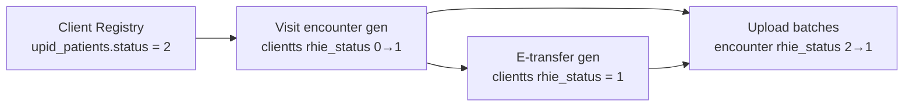

# Encounter ID — Business Rules

Business rules extracted from the PHP Encounter ID implementation. TypeScript must preserve these exactly.

---

## Eligibility Rules (All Generators)

### UPID exclusion

- SQL filter: `u.upid NOT LIKE 'UP%'`
- Before insert: `rhieSanitizeUpid($upid)` applied
- On-demand helpers also call `rhieUpidIsExcluded()` and skip excluded UPIDs

### Date range

- All batch generators filter: `date BETWEEN ? AND CURRENT_DATE()` (or `DATE(nc.date)` for NCD tables)
- Start date parameter passed from batch (currently hardcoded in PHP)

### Referral flag

- Most selection queries LEFT JOIN `referral` and compute `CASE WHEN r.id IS NOT NULL THEN TRUE ELSE FALSE END AS referral`
- **The referral flag is selected but not used** in encounter generation logic (no filtering on referral)

### Deleted records

- `clientts`, `orders`: `deleted = 0` where applicable
- `referral`: `deleted = 0` in referral generator

---

## Generator-Specific Rules

### 1. Visit Encounters (`generateEncountersVisit`)

| Rule | Value |
|------|-------|
| Source table | `clientts` |
| Source filter | `rhie_status = 0`, `deleted = 0` |
| UPID join | `c.client_id = u.patient_id` |
| Grouping key | `client_id + date` |
| Main encounter type | `VISIT_ENCOUNTER` |
| Deduplication | `checkMainEncounterExists(..., 'VISIT_ENCOUNTER')` |
| After insert | `markVisitAsUploaded(client_id)` → `clientts.rhie_status = 1` |
| Insert status | `rhie_status = 2` |

### 2. E-Transfer (`generateEncountersTransfer`)

| Rule | Value |
|------|-------|
| Source table | `clientts` |
| Source filter | `rhie_status = 1` (visit already generated) |
| Main encounter type | `E_TRANSFER` |
| Deduplication | `checkMainEncounterExists(..., 'E_TRANSFER')` |
| After insert | **No** source status update (markVisit commented out) |

### 3. Orders — Consultation / Medicine (`generateEncountersFromOrders`)

| Rule | Value |
|------|-------|
| Source table | `orders` |
| Source filter | `type = ?`, `rhie_status = 0`, `deleted = 0` |
| UPID join | `o.client_id = u.client_id` (**not patient_id**) |
| Patient encounter type | Parameter: `CONSULTATION_ENCOUNTER` or `MEDICINE_ENCOUNTER` |
| Order type param | `consultation` or `med` |
| Per-order insert | One `encounter_patients` row per order in group |
| After insert | `markOrderAsUploaded(order_id)` |
| Main encounter | **None** |

### 4. Complaint (`generateComplaintEncounters`)

| Rule | Value |
|------|-------|
| Source table | `vital_sign` |
| Filter | `vital_id = 9`, `rhie_status = 0` |
| UPID join | `vs.patient_id = u.patient_id` |
| Deduplication | ROW_NUMBER per UPID — only `rn = 1` (earliest date, lowest vital_sign_id) |
| Patient encounter type | `complaint` |
| source_table | `vital_sign` |
| After insert | `markComplaintAsUploaded(patient_id, date)` — only vital_id=9 rows |

### 5. Vital Signs (`generateVitalSignEncounters`)

| Rule | Value |
|------|-------|
| Source table | `vital_sign` |
| Filter | `vital_id IN (1,2,3,8,9,11,12,20,27,28,29,30)`, `rhie_status = 0` |
| Main encounter type | `encounter_vital` (insert) |
| Main check type | `encountervital` (**mismatch — preserve**) |
| Patient encounter type | `vital_sign` |
| After insert | `markVitalSignAsUploaded(patient_id, date)` — all vitals on date |

### 6. Lab Request (`generateLabRequestEncounters`)

| Rule | Value |
|------|-------|
| Source table | `orders` + `acts` |
| Filter | `type = 'laboratoire'`, `rhie_status = 0`, `deleted = 0` |
| UPID join | `o.client_id = u.patient_id` |
| Patient encounter type | `lab_request` |
| After insert | `markOrderAsUploaded(order_id)` |

### 7. Lab Results (`generateLabEncounters`)

| Rule | Value |
|------|-------|
| Source table | `lab_results` |
| Filter | `rhie_status = 0` |
| UPID join | `l.client_id = u.patient_id` |
| Patient encounter type | `lab` |
| source_table | `lab_results` |
| After insert | `markLabAsUploaded(test_id)` |

### 8. Diagnostic (`generateDiagEncounters`)

| Rule | Value |
|------|-------|
| Source table | `diag_client` + `diags` |
| Filter | `rhie_status = 0`, `reference_reason IS NULL` |
| Ranking | One diag per client — longest `d.english` text (ROW_NUMBER) |
| Main encounter type | `consultation` |
| Main check type | `consultation` |
| Patient encounter type | `diagnostic` |
| source_table | `diag_client` |
| Time field | `date('Y-m-d H:i:s')` for both time columns on patient encounter |
| After insert | `markDiagAsUploaded(client_id, date)` |

### 9. NCD Vitals (`generateVitalNCDsEncounters`)

| Rule | Value |
|------|-------|
| Source table | `ncds` |
| Filter | `vitael_id IN (1,2,3,5,11,12,13,15,17,20,21)`, `rhie_status = 0` |
| UPID join | `nc.client_id = u.client_id` |
| Date | `DATE(nc.date)` |
| Main type | `encounterNCDsvital` |
| Patient type | `vital_ncds` |
| source_table | `ncds` |

### 10. NCD Plaintes (`generatePlaintesNCDsEncounters`)

| Rule | Value |
|------|-------|
| Filter | `vitael_id = 18` |
| Main type | `encounterNCDsPlaintes` |
| Patient type | `plainte_ncds` |

### 11. NCD Diagnostic (`generateDiagnosticNCDsEncounters`)

| Rule | Value |
|------|-------|
| Filter | `vitael_id = 19` |
| Main type | `encounterNCDsDiagnostic` |
| Patient type | `diagnostic_ncds` |

### 12. Referral (`generateReferralEncounters`)

| Rule | Value |
|------|-------|
| Source table | `referral` |
| Filter | `rhie_status = 0`, `referral_reason_id IS NOT NULL`, `deleted = 0` |
| UPID join | `dc.client_id = u.patient_id` |
| Patient type | `referral` |
| source_table | `diag_client` (**not `referral`**) |
| After insert | **No status update** (comment placeholder only) |

---

## Encounter Record Rules

### UUID generation

PHP `generateUuid()` produces RFC-4122-like v4 UUIDs using `mt_rand`. TypeScript ports the same algorithm for reproducibility in tests; production uses the same function.

### Insert status values

| Field | Value on insert |
|-------|-----------------|
| `encounter_main.rhie_status` | `2` |
| `encounter_patients.rhie_status` | `2` |
| `rhie_uploaded_at` | `date('Y-m-d H:i:s')` at insert time |

Status `2` means "ID generated, pending HIE upload". Upload batches later set `rhie_status = 1`.

### Main encounter ON DUPLICATE KEY UPDATE

`insertMainEncounter` upserts: on duplicate key, updates `rhie_status` and `rhie_uploaded_at` only.

### Grouping behaviour

- One main encounter per `(upid, client_id, date, type)` when deduplication applies
- Patient encounters: one row per source record (order, lab, vital, etc.) within each group

---

## Workflow Prerequisites

- Visit generation requires `clientts.rhie_status = 0` (client visit not yet encounter-processed)
- E-transfer requires `clientts.rhie_status = 1` (visit encounter already generated)
- Other generators use their own source table `rhie_status = 0`

---

## Shadow Mode Rules (TypeScript)

| Action | Shadow | Production |
|--------|--------|------------|
| Run selection SQL | Yes | Yes |
| Build encounter insert payloads | Yes | Yes |
| Log payloads | Yes | Yes |
| INSERT encounter_main / encounter_patients | No | Yes |
| UPDATE source rhie_status | No | Yes |

Default: `executionMode: shadow` in platform config.

---

## Error Handling

### PHP batch

- Per-generator try/catch — logs error, continues to next generator
- Per-facility try/catch — logs facility failure, continues to next facility
- No rollback on partial group processing

### TypeScript (match PHP)

- Same isolation: generator failure does not stop other generators
- No transaction wrapping across multiple inserts in a group
- Log structured errors with generator name and facility context
