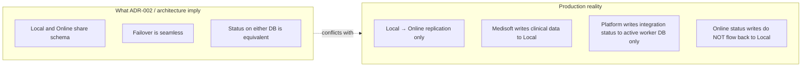
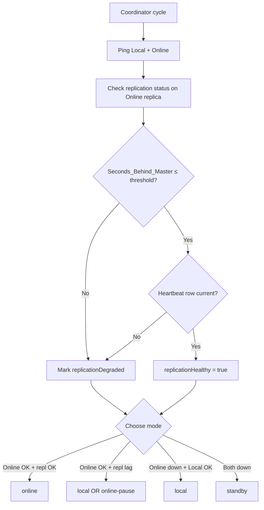

# MySQL Replication and RHIE Status Synchronization — Architecture Review

**Phase:** Pre-implementation validation  
**Status:** Analysis only — no code changes  
**Date:** 2026-06-28

---

## Executive Summary

The Integration Platform currently behaves like **Option A**: the active worker reads and writes **one database** (Online in normal operation, Local on failover). The coordinator prevents simultaneous Online and Local processing, but **does not monitor MySQL replication** and **does not synchronize RHIE metadata across databases**.

Given **unidirectional Local → Online replication**, writing `rhie_status` and related integration fields only on the Online database will cause **Local and Online to diverge**. Failover to Local mode creates a **high risk of duplicate RHIE uploads** and **inconsistent pipeline state**.

**Recommended direction:** Treat **Local as the source of truth for RHIE synchronization metadata**, adopt a **dual-write or master-only write strategy** in the interim, and migrate toward **dedicated integration tables (Option C)**. Extend the Coordinator to monitor **replication health and lag**, not just TCP connectivity.

---

## 1. Deployment Context

| Component | Role |
|-----------|------|
| Local Medisoft MySQL | Facility master — clinical data written by Medisoft |
| Online Medisoft MySQL | Replica — receives Local changes via MySQL replication |
| Integration Platform | Reads pending records, uploads to RHIE, updates status fields |
| Coordinator | Chooses `online` / `local` / `standby` per facility |

**Confirmed replication direction:** Local → Online (user environment).  
**Not documented in code:** No reference to replication direction, lag, or binlog position anywhere in PHP or TypeScript.

---

## 2. How the Platform Updates RHIE Status Today

### 2.1 Worker database binding

Each worker receives **exactly one** `DatabaseConnection` based on mode:

| Mode | Connection target | Source |
|------|-------------------|--------|
| `online` | `onlineDatabases[n]` | `WorkerHost` → `MultiDatabaseManager.getTargetsForMode('online')` |
| `local` | `localDatabase` | `WorkerHost` → `getTargetsForMode('local')` |

All repository writes go through that single connection. There is **no dual-write** and **no cross-database transaction**.

### 2.2 Status fields by service

#### Client Registry

| Field | Table | Read (pending) | Write (after processing) |
|-------|-------|----------------|--------------------------|
| `status` | `upid_patients` | `IN (0, 1, 3)` | `2` success, `3` failed |

Implemented in `ClientRegistryRepository.updateUpidStatus()` / `markClientAsFailed()`.

#### Encounter ID

| Field | Table | Read | Write |
|-------|-------|------|-------|
| `rhie_status` | `clientts`, `orders`, `lab_results`, `vital_sign`, `ncds`, `diag_client`, … | `= 0` (or `= 1` for e-transfer) | `= 1` after encounter generated |
| `rhie_status` | `encounter_main`, `encounter_patients` | N/A (insert) | `= 2` on insert (pending upload) |
| `rhie_uploaded_at` | encounter tables | N/A | current timestamp |

#### Upload services (PHP today; TS stubs)

| Field | Table | Read | Write |
|-------|-------|------|-------|
| `rhie_status` | `encounter_main`, `encounter_patients` | `= 2` | `= 1` after HIE upload |
| `status` | `upid_patients` | `= 2` | prerequisite for upload batches |
| `rhie_status` | `orders`, etc. | varies | updated post-upload |

### 2.3 PHP legacy behaviour

PHP batches connect to facility databases via `getFacilityPDOConnection()` using `health_facilities.db_host`. They read and write status on **that single connection**. There is no awareness of Local/Online pairs or replication.

The TypeScript platform **introduced** Online/Local failover (ADR-004) but did not add replication-aware status synchronization.

---

## 3. Platform Assumptions (Implicit vs Actual)



| Assumption | Documented? | Valid for production? |
|------------|-------------|------------------------|
| Local → Online replication only | User environment | **Yes** |
| Online → Local replication | Not stated | **No** (unless separately configured) |
| Bidirectional sync | Not stated | **No** |
| Manual sync of RHIE status | Not stated | **Unknown** — not in platform code |
| Same data on Local and Online at read time | Implied by failover docs | **Only if replication is current AND no Online-only writes** |
| Only one worker role active | ADR-004, coordinator | **Yes** — enforced |
| Online is primary for RHIE uploads | Architecture | **Yes** — by design |

**Critical gap:** The platform assumes failover works because schemas match, but **integration metadata written on Online is invisible to Local** under unidirectional replication.

---

## 4. Divergence Analysis

### 4.1 Normal Online operation

```
Medisoft → Local (clinical INSERT/UPDATE)
         → replication → Online (clinical data appears)

Platform Online worker → reads Online
                       → uploads RHIE
                       → writes status on Online ONLY

Local still has: rhie_status = 0, upid status pending, no encounter rows
Online now has:  rhie_status = 1/2, encounter rows, upid status = 2
```

**Result:** Databases diverge on every processed record.

### 4.2 Failure modes

| Scenario | Duplicate uploads? | Missing uploads? | Inconsistent status? | Replication conflict? |
|----------|-------------------|------------------|----------------------|----------------------|
| Online worker processes; status on Online only; later Local failover | **Yes** — Local sees pending records | Unlikely for already-processed | **Yes** | No (Local unchanged) |
| Replication lag; Online worker polls before clinical row arrives | No | **Yes** — record not yet visible | Temporary | No |
| Online worker processes during lag; Local has record Online doesn't | No | **Yes** until lag clears | **Yes** | No |
| Local failover processes; status written to Local | No (if Online inactive) | Possible if Online had partial state | **Yes** vs Online | No — Local writes replicate to Online |
| Both DBs reachable; coordinator bug allows overlap | **Yes** | — | **Yes** | Possible if both write same row |
| Encounter ID on Online; failover to Local | **Yes** — new UUIDs generated | — | **Yes** — different `encount_id` values | No |
| Upload succeeds; status=2 on Online; replication stops | Failover → **duplicate upload** | — | **Yes** | No |

### 4.3 Encounter table special case

`encounter_main` / `encounter_patients` rows created on Online **do not exist on Local**. On Local failover:

- Encounter ID service sees `rhie_status = 0` on source tables
- Generates **new UUIDs**
- Downstream upload services reference different encounter IDs
- RHIE may receive duplicate clinical content under different encounter identifiers

This is more severe than a simple status mismatch.

---

## 5. Design Options Comparison

### Option A — Online service updates Online database only

**Current implicit behaviour.**

| | |
|--|--|
| **Advantages** | Simple; matches today's single-connection worker model; no cross-DB coordination; Online has lowest latency to central infrastructure |
| **Risks** | Local diverges on every update; failover causes duplicate uploads; encounter rows missing on Local; no recovery path without manual reconciliation |
| **Failure scenarios** | Online DB up but replication broken → Online may lack new clinical data; Online up, processed records → Local failover re-uploads everything pending on Local |
| **Recovery** | Manual SQL scripts to copy status fields Local ← Online (reverse direction, not automatic); or re-run uploads with HIE-side dedup (if any) |

**Verdict:** **Unsafe** for stated Local → Online replication with Local failover.

---

### Option B — Online service updates both Online and Local after success

| | |
|--|--|
| **Advantages** | Keeps both DBs aligned during normal operation; failover to Local sees correct status; minimal schema change; compatible with existing `rhie_status` columns |
| **Risks** | Partial dual-write (Online OK, Local fails) → divergence; ordering issues; double maintenance of every repository method; encounter inserts must dual-write too |
| **Failure scenarios** | Local unreachable during Online processing → same as Option A for that batch; network partition between facility Local and platform → writes fail |
| **Recovery** | Reconciliation job: compare status columns per `(table, pk)` between Local and Online; backfill missing side; use upload audit log to detect duplicates |

**Recommended variant — master-first dual-write:**

1. Write status to **Local (master) first** — replication propagates to Online
2. Write same status to **Online immediately** — avoids read-your-writes race on fast re-poll
3. If Local write fails → do not mark complete (retry or fail batch)
4. If Online write fails but Local succeeds → log warning, rely on replication (acceptable if lag is low)

**Verdict:** **Acceptable interim solution** if dual-write is applied to **all** integration writes (status updates AND encounter inserts).

---

### Option C — Dedicated integration tables

Example schema (conceptual):

```sql
rhie_sync_record (
  id BIGINT PK,
  facility_code VARCHAR,
  entity_type ENUM('upid','clientts','order',...),
  entity_key VARCHAR,          -- composite key serialized
  pipeline_stage VARCHAR,      -- client_registry, encounter_id, visit_upload, ...
  status ENUM('pending','processing','success','failed'),
  rhie_resource_id VARCHAR,
  last_attempt_at DATETIME,
  last_success_at DATETIME,
  attempt_count INT,
  error_message TEXT,
  UNIQUE (facility_code, entity_type, entity_key, pipeline_stage)
)
```

| | |
|--|--|
| **Advantages** | Separates clinical data from integration metadata; single source of truth; idempotency keys; audit trail; easier reconciliation; can live on Local master and replicate cleanly |
| **Risks** | Schema migration; all services must join/check new tables; PHP parity period; more complex queries |
| **Failure scenarios** | Same dual-write question if table only on one DB — **table should live on Local master** |
| **Recovery** | Integration table is authoritative; replay failed rows; clinical `rhie_status` can become derived/deprecated over time |

**Verdict:** **Best long-term architecture**; aligns with replication topology.

---

## 6. Replication Monitoring — Coordinator Extension

### 6.1 Current coordinator checks

| Check | Implemented? |
|-------|--------------|
| TCP / pool ping to Local | Yes — `dbManager.pingAll()` |
| TCP / pool ping to Online | Yes |
| Replication IO/SQL thread status | **No** |
| Replication lag (`Seconds_Behind_Master`) | **No** |
| Binlog position drift | **No** |
| Replication heartbeat table | **No** |
| Worker host health | Yes |

Mode decision today:

```
Local OK + Online OK  → online
Local OK + Online down → local
Online OK + Local down → online
Both down              → standby
```

**Missing:** Online may ping OK but be **hours behind** Local — platform would process stale data or miss records.

### 6.2 Proposed replication health model



#### Checks to implement (on Online replica)

```sql
SHOW REPLICA STATUS;  -- or SHOW SLAVE STATUS on older MySQL
-- Monitor: Replica_IO_Running, Replica_SQL_Running, Seconds_Behind_Source
```

#### Optional heartbeat table (on Local master)

```sql
-- Written every N seconds by Medisoft cron or platform agent on Local
rhie_replication_heartbeat (facility_code, updated_at)

-- Coordinator reads from Online; if NOW() - updated_at > threshold → replication stale
```

#### Extended `CoordinatorState` fields (proposal)

```typescript
interface FacilityProcessingState {
  facilityId: string;
  mode: ProcessingMode;
  onlineAvailable: boolean;
  localAvailable: boolean;
  replicationHealthy: boolean;
  replicationLagSeconds: number | null;
  lastReplicationCheck: string;
  reason?: string;
}
```

#### Mode decision with replication

| Local | Online | Replication | Recommended mode |
|-------|--------|---------------|------------------|
| OK | OK | Healthy, lag ≤ 30s | `online` |
| OK | OK | Lag > threshold | `local` or `standby` (policy choice) |
| OK | OK | Broken threads | `local` if safe; else `standby` |
| OK | Down | — | `local` |
| Down | OK | Healthy | `standby` (cannot verify Local clinical source) |
| Down | Down | — | `standby` |

**Policy note:** When replication is lagging, switching to `local` ensures workers read current clinical data from master, but requires **Local-authoritative integration writes** (Option B variant or C).

---

## 7. Final Recommendation

### 7.1 Source of truth

| Data type | Source of truth | Rationale |
|-----------|-----------------|-----------|
| Clinical records (patients, visits, orders) | **Local (master)** | Medisoft writes here; replication propagates outward |
| RHIE synchronization metadata | **Local (master)** | Must replicate to Online; survives failover |
| Read surface for Online workers | **Online (replica)** | Acceptable when replication is healthy and metadata is synchronized |
| RHIE API responses / audit | **Integration platform logs + integration tables** | Not stored today; needed for recovery |

### 7.2 Which service performs RHIE uploads

| Mode | When | Reads from | Writes metadata to |
|------|------|------------|-------------------|
| **Online (primary)** | Replication healthy | Online replica | **Local master first**, Online replica immediately (dual-write) |
| **Local (failover)** | Online unavailable or replication broken | Local master | Local master only |
| **Standby** | Both unavailable, or unsafe to process | — | — |

Only **one mode active per facility** (keep current coordinator gating).

### 7.3 How `rhie_status` stays synchronized

**Phase 1 (before new services):**

- Adopt **Option B master-first dual-write** for all integration status updates and encounter inserts
- Add `@rhie/database` helper: `writeIntegrationStatus(localConn, onlineConn, sql, params)`
- Local write is mandatory for completion; Online write is best-effort with replication fallback

**Phase 2 (recommended):**

- Introduce **Option C integration tables** on Local master
- Services check integration table for idempotency before RHIE upload
- Deprecate direct `rhie_status` writes on business tables gradually (or keep as derived cache)

### 7.4 Failover when replication stops

1. Coordinator detects Online unreachable OR replication threads stopped
2. Switch facility to `local` mode
3. Local workers process from Local master (current clinical data + integration metadata if dual-write was working)
4. If Online was processing with Option A only → **pause uploads**, run reconciliation before resuming

### 7.5 Recovery when replication resumes

1. Coordinator detects replication healthy + lag below threshold
2. **Reconciliation pass:**
   - Compare integration metadata Local vs Online for each facility
   - Backfill Online from Local (metadata flows with replication naturally if writes were Local-first)
   - For any Online-only orphan status (legacy Option A period), copy to Local or reset to pending with audit
3. Verify no worker processed duplicates during transition (check platform logs / integration table)
4. Switch facility back to `online` mode
5. Monitor lag for 24h before declaring stable

### 7.6 Do not proceed with additional RHIE services until

- [ ] Replication monitoring is specified and scheduled for Coordinator implementation
- [ ] Dual-write or integration-table strategy is chosen and documented as ADR
- [ ] Failover/reconciliation runbook is written for operations
- [ ] Shadow mode validation includes Local vs Online status comparison queries

---

## 8. Proposed ADR (for future implementation)

**ADR-033 (draft):** RHIE metadata writes must target Local master with Online dual-write; Online-only status updates are prohibited under Local → Online replication.

**ADR-034 (draft):** Coordinator must monitor replication lag and thread health before assigning `online` mode.

---

## 9. Validation Queries (operations — run manually today)

Compare pending counts between Local and Online for a facility:

```sql
-- Client Registry pending
SELECT COUNT(*) FROM upid_patients WHERE status IN (0,1,3) AND upid NOT LIKE 'UP%';

-- Encounter source pending
SELECT COUNT(*) FROM clientts WHERE rhie_status = 0 AND deleted = 0;

-- Encounter rows on Online not on Local (if comparing across hosts)
SELECT COUNT(*) FROM encounter_main WHERE rhie_status = 2;
```

Run on both Local and Online after a processing window. **Mismatched counts confirm divergence.**

Replication status on Online:

```sql
SHOW REPLICA STATUS\G
```

---

## 10. References

| Document | Relevance |
|----------|-----------|
| `docs/architecture.md` | Failover design, service workflow |
| `docs/coordinator.md` | Mode logic, duplicate prevention |
| `docs/playbook.md` ADR-002, ADR-004 | DB-as-bus, mode gating |
| `docs/client-registry-database-analysis.md` | `upid_patients.status` |
| `docs/encounter-id-database-analysis.md` | `rhie_status` semantics |
| `packages/worker-framework/src/execution-mode.ts` | Worker gating |
| `apps/coordinator/src/index.ts` | Health checks (connectivity only) |
