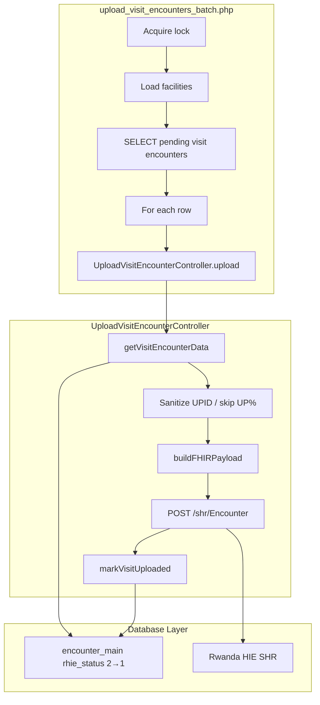

# Visit Encounter Upload Analysis

Reverse-engineering analysis of the existing Medisoft PHP Visit Encounter Upload implementation.

**Source files analyzed:**

| File | Role |
|------|------|
| `rhie/batches/upload_visit_encounters_batch.php` | Batch entry point — multi-facility visit encounter FHIR upload |
| `rhie/controllers/UploadVisitEncounterController.php` | Business logic — payload build, HIE POST, status update |
| `rhie/models/UploadEncounterModel.php` | Data access — visit data fetch and mark uploaded |
| `rhie/models/GetEncounterModel.php` | SQL for visit encounter payload fields |
| `rhie/controllers/GetEncounterController.php` | Thin wrapper over GetEncounterModel |
| `rhie/api/get_visit_encounter_api.php` | HTTP API for visit data (non-batch path) |
| `rhie/config/upid_filter.php` | UPID sanitization and exclusion |

**Related but out of scope for this service:**

| File | Role |
|------|------|
| `rhie/controllers/UploadEncounterController.php` | Observation/referral upload (Observation service) |
| `rhie/batches/upload_visit_ref_encounters_batch.php` | E-transfer upload batch |
| `rhie/batches/upload_consult_encounters_batch.php` | Consultation upload batch |

---

## System Overview

The Visit Encounter Upload module uploads **VISIT_ENCOUNTER** records from `encounter_main` to the Rwanda HIE Shared Health Record (SHR) as FHIR `Encounter` resources. Records must already have `rhie_status = 2` (ready for upload) and a registered UPID (`upid_patients.status = 2`).



---

## Workflow

### Batch (`upload_visit_encounters_batch.php`)

1. Acquire batch lock (`upload_visit_encounters_batch`)
2. Load HIE credentials from `config/hie.php`
3. Iterate facilities (with rotation slice via `rhieBatchFacilitySlice`)
4. Connect to facility DB
5. Run batch selection SQL (LIMIT from `rhieBatchRecordLimit()`)
6. For each row: call `UploadVisitEncounterController->upload($client_id, $date, 'VISIT_ENCOUNTER', $facilityID)`
7. Per-row errors caught and logged; batch continues
8. Release lock on completion

### Upload controller (`UploadVisitEncounterController::upload`)

For `VISIT_ENCOUNTER` type:

1. Fetch visit rows via `UploadEncounterModel::getVisitEncounterData($clientId, $date, $facilityId)`
2. For each visit row:
   - Sanitize UPID via `rhieSanitizeUpid()`
   - Skip if `rhieUpidIsExcluded()` (UPID starts with `UP`)
   - Build FHIR payload via `buildFHIRPayload()`
   - POST to HIE via `sendToHIE($payload, 'visit')`
   - **Always** call `markVisitUploaded($resource_encount_id)` — regardless of HTTP response
3. Return array of HIE response metadata

### Data fetch path

In batch/CLI mode (`RHIE_BATCH_DIRECT`), `UploadEncounterModel` reads directly from `GetEncounterModel::getVisitEncounterData()` — no HTTP API call.

In web/API mode, it would call `get_visit_encounter_api.php` — the Node worker uses direct DB reads (equivalent to batch direct mode).

---

## SQL Queries

### 1. Batch selection (`upload_visit_encounters_batch.php`)

```sql
SELECT DISTINCT
  em.client_id, up.upid, em.date, p.age,
  em.encount_id AS resource_encount_id
FROM encounter_main em
LEFT JOIN upid_patients up ON em.client_id = up.client_id
LEFT JOIN patients p ON em.client_id = p.patient_id
WHERE type IN ('VISIT_ENCOUNTER')
AND em.rhie_status = 2 AND up.status = 2
AND up.upid NOT LIKE 'UP%'
AND (up.document_number IS NOT NULL OR up.document_number NOT LIKE 'TP-%')
AND p.age IS NOT NULL
AND p.age REGEXP '^[0-9]{4}-[0-9]{2}-[0-9]{2}$'
ORDER BY date ASC
LIMIT ?
```

### 2. Visit payload data (`GetEncounterModel::getVisitEncounterData`)

```sql
SELECT em.encount_id AS resource_encount_id, em.upid, em.client_id,
  em.date AS visit_date, p.beneficiary AS patient_name,
  'VISIT_ENCOUNTER' AS type_display, ...
FROM encounter_main em
INNER JOIN clientts c ON c.client_id = em.client_id AND c.date = em.date
INNER JOIN patients p ON p.patient_id = em.client_id
LEFT JOIN users u ON c.user_id = u.id
LEFT JOIN address ad ON ad.address_id = 1
WHERE em.rhie_status = 2 AND c.deleted = 0
AND em.type = 'VISIT_ENCOUNTER' AND em.date = ? AND em.client_id = ?
AND em.upid NOT LIKE 'UP%'
```

Note: `$facilityId` parameter is accepted but **not used** in the SQL.

### 3. Mark uploaded (`UploadEncounterModel::markVisitUploaded`)

```sql
UPDATE encounter_main
SET rhie_status = 1, rhie_uploaded_at = NOW()
WHERE encount_id = ?
```

---

## RHIE API

| Property | Value |
|----------|-------|
| Method | POST |
| URL | `{hie_url}/shr/Encounter` |
| Content-Type | `application/fhir+json` |
| Accept | `application/fhir+json` |
| Auth | HTTP Basic (`hie_username:hie_password`) |
| SSL verify | Disabled |
| Success codes | 200, 201 |
| Retry | None — single attempt |

Response shape returned by controller:

```json
{
  "endpoint": "/shr/Encounter",
  "kind": "visit",
  "encounter_id": "<uuid>",
  "upid": "<upid>",
  "http_code": 201,
  "response": { ... parsed FHIR response ... }
}
```

---

## Database Updates

| When | Table | Columns | Values |
|------|-------|---------|--------|
| After every upload attempt | `encounter_main` | `rhie_status`, `rhie_uploaded_at` | `1`, `NOW()` |

**Important:** PHP marks the encounter uploaded even when the HIE POST fails. This is preserved in the Node implementation for parity.

---

## Error Handling

| Level | Behavior |
|-------|----------|
| Per-record upload | try/catch → log message, continue to next row |
| Per-facility | try/catch → log facility failure, continue to next facility |
| UPID excluded | skip row silently (continue loop) |
| Empty visit data | return empty results array |
| HTTP failure | log response; **still mark uploaded** |
| Retry | None |

---

## Comparison with Node.js Platform (Before Implementation)

| Aspect | PHP | Node (before) |
|--------|-----|---------------|
| Worker | `upload_visit_encounters_batch.php` cron | `VisitEncounterWorker` stub |
| Business logic | `UploadVisitEncounterController` | Not implemented |
| SQL | Inline in batch + GetEncounterModel | Not implemented |
| HIE upload | curl POST `/shr/Encounter` | `@rhie/rhie-client.uploadVisitEncounter()` pointed at `/encounters/visit` |
| Status update | `markVisitUploaded` | Not implemented |
| Shadow mode | N/A | N/A in PHP; added in Node for safe rollout |
