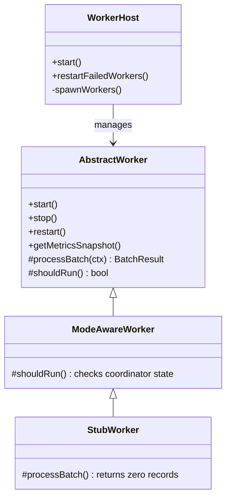

# Worker Framework

The `@rhie/worker-framework` package provides the core execution engine for all RHIE integration services.

## Architecture



## Key Classes

### `AbstractWorker`

Base class for all workers. Provides:

- Continuous execution loop (poll → process → sleep)
- Graceful shutdown (waits for in-flight batch)
- Heartbeat emission
- Metrics snapshot
- Error handling with automatic recovery
- Correlation ID per batch

Subclasses implement:
- `workerType` — identifier string
- `processBatch(ctx)` — business logic (returns processed/failed/skipped counts)

### `ModeAwareWorker`

Extends `AbstractWorker` with coordinator state gating. Workers only process when their mode (`online` or `local`) matches the coordinator's decision.

### `WorkerHost`

Generic process that:
1. Loads configuration
2. Connects to all databases via `MultiDatabaseManager`
3. Creates one RHIE client
4. Spawns workers: **one per (workerType × mode × facility)**
5. Starts health and metrics HTTP servers
6. Handles graceful shutdown

## Execution Modes

| Mode | Database | When active |
|------|----------|-------------|
| `online` | Per-facility online DB | Coordinator mode = `online` |
| `local` | Single local DB | Coordinator mode = `local` |

One worker class serves both modes — mode is passed via `WorkerIdentity.mode`.

## Creating a New Worker

```typescript
import { ModeAwareWorker, type WorkerFactory, type WorkerDependencies, type WorkerIdentity } from '@rhie/worker-framework';

class MyWorker extends ModeAwareWorker {
  get workerType() { return 'my-service'; }

  protected async processBatch(ctx) {
    // business logic here
    return { processed: 0, failed: 0, skipped: 0 };
  }
}

export const myWorkerFactory: WorkerFactory = {
  workerType: 'my-service',
  create(deps, identity) { return new MyWorker(deps, identity); },
};
```

Register in `services/registry/src/index.ts`.

## Configuration

| Setting | Source | Default |
|---------|--------|---------|
| `worker.sleepIntervalMs` | platform.yaml | 5000 |
| `worker.batchSize` | platform.yaml | 50 |
| `worker.heartbeatIntervalMs` | platform.yaml | 10000 |
| `WORKER_TYPES` | env (worker-host) | all registered |
| `WORKER_MODES` | env (worker-host) | online,local |
| `SERVICE_NAME` | env (worker-host) | worker-host |

## Dependencies

- `@rhie/config` — configuration
- `@rhie/database` — database connections
- `@rhie/rhie-client` — RHIE API
- `@rhie/retry` — retry logic
- `@rhie/health` — health checks
- `@rhie/metrics` — metrics collection
- `@rhie/logger` — structured logging
