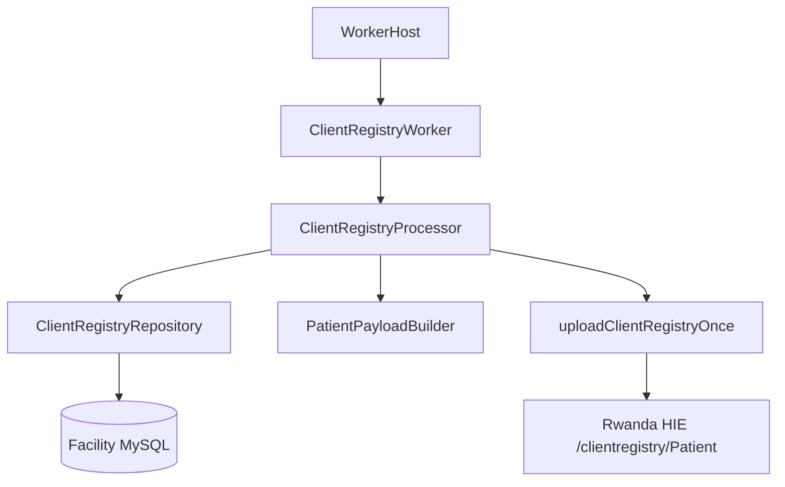

# Client Registry Service

Production Client Registry service — first reference implementation for the RHIE Integration Platform.

## Overview

Uploads patient demographics from Medisoft `upid_patients` to the Rwanda HIE Client Registry as FHIR `Patient` resources. Behaviour is identical to the legacy PHP batch (`client_registry_batch.php` + `ClientRegistryController.php`).

## Architecture



## Components

| Component | File | Responsibility |
|-----------|------|----------------|
| `ClientRegistryWorker` | `worker/client-registry.worker.ts` | Worker framework integration |
| `ClientRegistryProcessor` | `domain/client-registry.processor.ts` | Business workflow (mirrors PHP Controller) |
| `ClientRegistryRepository` | `repository/client-registry.repository.ts` | Exact SQL from PHP Model + batch |
| `PatientPayloadBuilder` | `domain/patient-payload.builder.ts` | FHIR payload (mirrors `buildPatientPayload`) |

## Execution Modes

Configured via `configs/platform.yaml`:

```yaml
clientRegistry:
  executionMode: shadow    # shadow | production
  requireReferral: true      # matches PHP batch INNER JOIN referral
  excludeTemporaryDocuments: true
  maxClientsPerBatch: 15     # matches max_clients_registry_per_run
```

### Shadow Mode

- Reads pending records from database
- Builds FHIR payload
- Logs payload JSON
- Does **not** call HIE
- Does **not** update `upid_patients.status`

Use shadow mode for validation before production cutover.

### Production Mode

- Full upload workflow identical to PHP
- Single HTTP attempt per UPID (no retry — matches PHP)
- Success (HTTP 200/201) → `status = 2`
- Failure → `status = 3`
- Unhandled client exception → `markClientAsFailed()` all UPIDs

## Workflow

```
findPendingClientIds(limit)
  → for each patient_id:
      getUpidsByClient(client_id)    # PHP uses same ID for both
      → for each upid:
          sanitize + exclude UP*
          getClientDataByUpid(upid)
          if no data → status 3 (production only)
          buildPatientPayload(data)
          if shadow → log payload, skip
          else uploadClientRegistryOnce(payload)
          if success → status 2, else status 3
      on exception → markClientAsFailed(client_id)
```

## Status Values

| Value | Meaning |
|-------|---------|
| 0 | Pending |
| 1 | Retry |
| 2 | Success |
| 3 | Failed |

## Running

```bash
# Shadow mode (default in platform.yaml)
npm run dev:client-host

# Production mode — set in configs/platform.yaml:
# clientRegistry.executionMode: production
```

## Tests

```bash
npm run test:client-registry
```

Tests cover:
- UPID sanitization (PHP parity)
- Payload builder (all field mappings)
- Processor shadow mode behaviour
- Error handling (markClientAsFailed)

## Reference Documentation

- [Business Rules](../../docs/client-registry-business-rules.md)
- [Database Analysis](../../docs/client-registry-database-analysis.md)
- [Payload Mapping](../../docs/client-registry-payload-mapping.md)
- [RHIE API Analysis](../../docs/client-registry-rhie-api-analysis.md)
